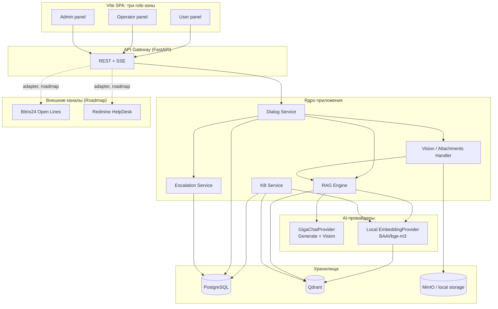
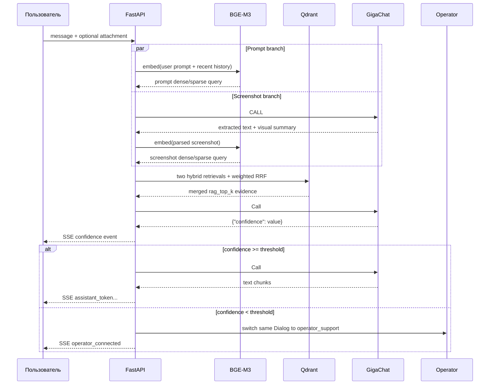

# Архитектура AI-агента техподдержки 1С

> Единый архитектурный контракт проекта: backend, RAG/GigaChat pipeline и три frontend-панели `user / operator / admin`.

## Оглавление

### Часть I — Общая архитектура
1. TL;DR  
2. Контекст, цели и требования  
3. Архитектурные решения  
4. Высокоуровневая архитектура  
5. Технологический стек и LangChain-first  
6. Нефункциональные требования  
7. Метрики эффективности  
8. MVP и Roadmap  
9. Риски  

### Часть II — Backend
10. Границы backend  
11. Lifecycle тикета  
12. RAG  
13. GigaChat + LangChain/GigaChain  
14. Скриншоты и runtime attachments  
15. Внешние каналы Bitrix24/Redmine  
16. Модель данных  
17. Что сознательно не усложняем  

### Часть III — Frontend
18. Общая frontend-архитектура  
19. SSE и взаимодействие с backend  
20. Backend API contract для frontend  
21. User panel  
22. Operator panel  
23. Admin panel  
24. Admin — Knowledge Base  
25. Admin — System Prompts  
26. Admin — AI Settings  
27. Admin — Monitoring  
28. Frontend project structure  
29. Frontend performance / correctness  
30. Frontend security  

### Часть IV — План разработки и справка
31. Вертикальные срезы разработки  
32. Структура репозитория  
33. Источники

# Часть I — Общая архитектура

## 1. TL;DR

- **Фронтенд собственный** (не 1С/Bitrix24 UI): одно SPA с тремя панелями — `user`, `operator`, `admin`. Backend остаётся channel-agnostic, поэтому Bitrix24/Redmine позже подключаются через адаптеры без переписывания ядра.
- **Backend — модульный монолит на FastAPI**, не микросервисы: меньше DevOps-расходов на хакатон, модули (RAG, Vision, Escalation, KB) изолированы и готовы к выносу в отдельные сервисы позже.
- **GigaChat — центральная генеративная модель:** используем API для формирования финального ответа и анализа приложенных скриншотов. Для MVP основной кандидат — `GigaChat (активная модель)`.
- **Embeddings делаем локально:** Freemium предоставляет бесплатные токены генерации, но векторное представление текста оплачивается отдельно. Поэтому retrieval не зависит от платного Embeddings API; основной локальный кандидат — `BAAI/bge-m3`.
- **Критичное ограничение Freemium — 1 поток генерации.** Обычный пользовательский turn использует до **двух последовательных GigaChat generation-call** (`confidence → answer/draft`), а turn со screenshot — до **трёх** (`screenshot parse → confidence → answer/draft`).
- **GigaChain используем точечно**, где он ускоряет интеграцию с GigaChat/LangChain, но не строим многошаговую agent-chain, которая последовательно занимает единственный поток.

## 2. Контекст, цели и требования

### Заказчик и бизнес-цели

Компания: **АО «Молвест»**. Цель — AI-агент для автоматизации техподдержки пользователей 1С.

| Бизнес-цель | Целевой показатель |
| --- | --- |
| Снизить нагрузку на техподдержку | −30–40% обращений к операторам |
| Сократить время ожидания | <5 сек на генерацию ответа |
| Единообразие ответов | централизованная база знаний |
| Круглосуточная поддержка | без участия человека |

### Функциональные сценарии и приоритет реализации

| # | Сценарий | Статус на хакатон | Ключевая механика |
| --- | --- | --- | --- |
| 1 | **Вопрос–ответ (чат-бот)** | **Обязательный MVP** | Пользователь пишет вопрос в нашем веб-чате → backend анализирует запрос → выполняет поиск по БЗ → GigaChat формирует понятный ответ → при низкой уверенности обращение эскалируется оператору |
| 2 | **Автоматическое подключение к существующему чату** | **Roadmap, не MVP** | В будущем агент подключается к Bitrix24/Redmine, читает сообщения в реальном времени и либо предлагает оператору черновик, либо отвечает автоматически по настройке |
| 3 | **Анализ изображений и скриншотов** | **Обязательный MVP, доступен в каждом диалоге по умолчанию** | В любом чате пользователь может приложить PNG/JPEG-скриншот 1С; агент извлекает текст и визуальные признаки, определяет ошибку/поле/состояние интерфейса и использует результат как часть RAG-запроса |
| 4 | **Управление базой знаний** | **Обязательный MVP** | Администратор создаёт/редактирует/удаляет разделы БЗ, загружает документы, запускает переиндексацию, обновляет источники и управляет параметрами системы |

#### 1.2.1 Текущий канал взаимодействия и совместимость с Bitrix24/Redmine

На хакатоне **основным интерфейсом является собственный frontend**, потому что так быстрее реализовать и качественно продемонстрировать основной пользовательский сценарий.

При этом backend проектируется **channel-agnostic**: бизнес-логика не зависит от UI. Входящее сообщение нормализуется в единый контракт `IncomingMessage`, а ответ — в `OutgoingMessage`.

- сейчас источником сообщений является наш веб-frontend;
- позже Bitrix24 и Redmine подключаются через адаптеры без изменения RAG, Vision, Dialog и Escalation-логики;
- REST/SSE API backend остаётся единым ядром системы;
- особенности конкретного канала изолируются в `IChannelAdapter`.

Цель: после хакатона интеграция с Bitrix24/Redmine должна быть **подключением нового интерфейсного адаптера, а не переписыванием backend**.

#### 1.2.2 Эскалация и настраиваемый порог уверенности

Если confidence ниже порога, обращение переводится оператору.

Порог уверенности:

- хранится как системная настройка;
- по умолчанию — **80%**;
- настраивается в админ-панели;
- изменение порога не требует перезапуска приложения.

Отдельного `escalation_reason` в MVP нет.

Причина эскалации восстанавливается из персистентного system-сообщения, которое backend создаёт в момент перехода:

```text
Message.author_type = system
Message.text = "К обращению подключился специалист поддержки."
Message.confidence = <confidence текущего turn>
Message.sources = <snapshot RAG evidence>
```

Таким образом в журнале сохраняются и значение confidence, и источники, на основании которых был принят routing decision, без отдельной сущности/поля причины эскалации.

### Источники данных и структура базы знаний

База знаний должна быть **секционной и расширяемой**: администратор может добавлять и удалять логические разделы без изменения кода.

Минимальные разделы:

1. **Документация 1С**
   - официальная документация по платформе;
   - типовые конфигурации;
   - руководства пользователя;
   - руководства администратора.

2. **Журнал обращений**
   - успешно решённые инциденты;
   - неуспешно решённые инциденты;
   - запросы пользователей и итоговые решения;
   - статус решения хранится в метаданных.

3. **Внутренняя база знаний техподдержки АО «Молвест»**
   - инструкции;
   - регламенты;
   - внутренние руководства;
   - памятки и типовые решения.

Поддерживаемые форматы исходных документов: **Word, PDF, HTML, Markdown**.

Изображения и скриншоты пользователей являются runtime-источником контекста: извлечённый из них текст и визуальное описание участвуют в поиске по БЗ и генерации ответа.

На MVP база знаний должна содержать **как минимум реальную документацию 1С**, чтобы основной RAG-сценарий демонстрировался на фактических данных.

## 3. Архитектурные решения (ADR)

### ADR-1 · Собственный фронтенд сейчас, Bitrix24/Redmine через адаптеры позже

- **Контекст:** ТЗ предполагает Bitrix24 и Redmine HelpDesk, но на хакатоне важнее быстро довести основной пользовательский сценарий до стабильного состояния.
- **Решение:** на MVP строим одно SPA с тремя role-зонами — пользователь, оператор и администратор. Backend сразу проектируем независимо от интерфейса, а Bitrix24/Redmine подключаем позднее через `IChannelAdapter`.
- **Почему:** собственный frontend ускоряет разработку и позволяет качественно проработать UX. Единые backend-контракты гарантируют, что позднее интеграция каналов не потребует переписывать RAG/Vision/KB-ядро.
- **Важно для MVP:** автоматическое подключение к существующему чату не реализуем как обязательный сценарий первого этапа — оно остаётся в Roadmap.
- **Отклонённая альтернатива:** начинать с виджета внутри Bitrix24/Open Lines — повышает интеграционные риски и отвлекает от критериев «работоспособность прототипа», «GigaChat» и «UX».

### ADR-2 · Модульный монолит вместо микросервисов

- **Решение:** один backend-сервис (FastAPI) с модулями `dialog`, `rag`, `vision`, `escalation`, `kb`, а не отдельные микросервисы.
- **Почему:** на хакатоне важнее скорость разработки и деплоя, чем изоляция; границы модулей спроектированы так, чтобы `rag`/`vision` можно было вынести в отдельные сервисы при росте нагрузки (они самые GPU/latency-чувствительные).

### ADR-3 · GigaChat как основная интеллектуальная модель + локальные embeddings

- **GigaChat используется в основном пользовательском сценарии:** отдельным structured-вызовом анализирует приложенный screenshot до retrieval, затем формирует финальный ответ с RAG-контекстом и повторно использует загруженные file ID. Конкретная модель GigaChat не зашита в код и выбирается администратором.
- **Embeddings API GigaChat в MVP не используем:** он оплачивается отдельно от Freemium-генерации, поэтому retrieval должен работать полностью локально и не зависеть от платной услуги.
- **Единственная embedding-модель MVP:** `BAAI/bge-m3`.
- **Почему `BGE-M3`:** мультиязычность (>100 языков), 1024-мерные dense-вектора, контекст до 8192 токенов, MIT-лицензия и возможность получать dense + sparse representations для hybrid retrieval.
- **Runtime BGE-M3:** зафиксированный snapshot модели скачивается на этапе сборки backend-образа, загружается через `BGEM3FlagModel` в FastAPI lifespan и прогревается до readiness. Во время обработки запросов сеть для Hugging Face не используется.
- **Интерфейсы разделяем:** `GigaChatProvider` отвечает за generation/multimodal input, `EmbeddingProvider` — за локальную векторизацию. Это не смешивает платёжные/сетевые ограничения GigaChat с индексом БЗ.
- **Ограничение Freemium:** один поток generation-запросов. Generation-вызовы одного turn выполняются строго последовательно под `Semaphore(1)`: два для обычного turn и до трёх для screenshot-turn; embeddings/retrieval выполняются локально.
- **Не делаем в MVP:** self-hosted генеративную LLM и альтернативные embedding-модели «на всякий случай». Если BGE-M3 не проходит наш golden dataset, модель меняется через `EmbeddingProvider`, но до измерений не усложняем архитектуру.

### ADR-4 · Qdrant + единая коллекция знаний

- **Решение:** Qdrant как поисковый индекс.
- **Основная коллекция:** `knowledge_chunks`.
- **Почему одна коллекция:** разделы БЗ должны динамически создаваться и удаляться из админки. Раздел — это metadata/payload (`section_id`), а не отдельная физическая коллекция.
- **Payload каждого чанка:** `document_id`, `title`, `heading_path`, `page`, `is_enabled`, `updated_at` и технические metadata для отображения источника.
- **Поиск:** hybrid retrieval — dense semantic search + sparse/lexical search, результаты объединяются через RRF.
- **Неуспешные обращения:** остаются в истории/аналитике и не публикуются как документы основной БЗ без административного approve.

## 4. Высокоуровневая архитектура



**Компоненты:**

- **Frontend** — на MVP: чат пользователя, панель оператора и админ-панель в одном Vite + React + TypeScript SPA. Возможность прикрепить скриншот присутствует в каждом диалоге по умолчанию. панель оператора с AI GigaChat входит в MVP; Roadmap относится только к внешним Bitrix24/Redmine.
- **API Gateway** — FastAPI, REST для команд/сообщений + SSE для streaming и событий состояния; те же контракты позже используются интеграционными адаптерами.
- **Dialog Service** — состояние диалога/история, роутинг в RAG/Vision/Escalation.
- **RAG Engine** — локальная векторизация (`EmbeddingProvider`) → hybrid retrieval из Qdrant → evidence для confidence/answer pipeline.
- **Vision / Attachments Handler** — хранит runtime attachment, для screenshot выполняет отдельный GigaChat parse (`extracted_text + visual_summary`) до RAG, затем переиспользует тот же `file_id` в confidence/answer pipeline.
- **Escalation Service** — сравнивает `dialog_confidence` с административным `operator_escalation_threshold` и при необходимости помещает обращение в операторскую очередь.
- **Error Review Service** — показывает администратору завершённые тикеты с `DialogFeedback.verdict=ai_error` и выполняет подтверждённое каскадное удаление разобранных ошибочных чатов.
- **KB Service** — CRUD документов, чанкинг, (ре)индексация.
- **Channel Adapters** (roadmap) — Bitrix24 Open Lines и Redmine HelpDesk через `IChannelAdapter`. Адаптер преобразует сообщения конкретной платформы в единый внутренний контракт backend и обратно.

## 5. Технологический стек и LangChain-first

| Слой | Технология | Почему |
| --- | --- | --- |
| Frontend | **React 18 + TypeScript + Vite + Tailwind + React Router v7 + React Query** | Один SPA для user/operator/admin; Router — маршрутизация, React Query — server state, Tailwind — UI |
| Realtime | **SSE + REST** | REST отправляет команды/сообщения; SSE доставляет токены GigaChat и события состояния тикета |
| Backend | Python 3.11 + FastAPI (async) | REST/SSE API, приём сообщений и файлов |
| Каналы | `IChannelAdapter` + REST/webhooks | MVP — собственный frontend; Bitrix24/Redmine адаптеры остаются Roadmap, но backend-контракт уже совместим |
| Генерация + Vision | GigaChat API: Lite / Pro / Max / Ultra через `langchain-gigachat` | Активная модель выбирается администратором; единый `GigaChatProvider` скрывает различия моделей от RAG/backend |
| Embeddings | **Локально `BAAI/bge-m3`** через `FlagEmbedding` / `sentence-transformers` | Бесплатно локально; RU/multilingual; dense+sparse representations для hybrid retrieval |
| Оркестрация | LangChain Core / LCEL + `langchain-gigachat` | Простые последовательные/параллельные Runnable-цепочки без agent executor; прозрачный контроль latency и числа GigaChat-вызовов |
| Векторная БД | Qdrant | Hybrid search, payload-фильтры, Docker-friendly |
| РСУБД | PostgreSQL | Диалоги, тикеты, метаданные БЗ, логи, метрики |
| Фоновые задачи | FastAPI `BackgroundTasks` / простой in-process worker | Для MVP достаточно для переиндексации небольшого объёма документов без отдельной очереди |
| Объектное хранилище | MinIO (S3-совместимо) | Скриншоты, исходные документы | Быстро извлекает текст/коды ошибки локально перед retrieval; GigaChat всё равно получает исходное изображение и выполняет смысловой Vision-анализ |
| Наблюдаемость | Application logs + базовые метрики backend | Latency, ошибки, confidence, источники ответа и эскалации без внешнего SaaS |
| Проверка RAG | `tests/rag/evaluate_rag.py` + `tests/rag/rag_golden.json` | Скрипт прогоняет тестовые вопросы через retrieval и показывает, попал ли ожидаемый источник в top-k |
| Деплой | Docker Compose (демо) → Kubernetes (прод) | Скорость на хакатоне, понятный путь роста |


### LangChain-first правило разработки

Для MVP **вся интеграция с GigaChat сначала реализуется средствами `langchain-gigachat` и LangChain Core**.

Прямые HTTP-вызовы GigaChat API и прямое использование Python SDK `gigachat` в сервисах запрещены, если та же возможность уже присутствует в `langchain-gigachat`.

Это относится к:

- generation;
- async generation;
- streaming;
- structured output;
- multimodal messages;
- upload/delete runtime-файлов;
- model parameters;
- retries;
- tracing metadata.

Исключение — только отсутствующая в wrapper-е возможность, изолированная внутри `GigaChatProvider`.

## 6. Нефункциональные требования

**Латентность (бюджет на <5 сек из ТЗ):**

| Этап | Бюджет |
| --- | --- |
| Local BGE-M3 embedding | измеряем на целевом железе |
| Поиск в Qdrant | целевой порядок десятки миллисекунд |
| GigaChat до первого токена | измеряем на API; UI использует streaming |
| End-to-end | целевой KPI заказчика <5 с; обязательно подтвердить экспериментально |

*Открытый вопрос для приёмки: считать SLA «<5 сек» как время до первого токена (со стримингом) или до полного ответа — уточнить у В.В. Донцовой.*

**Безопасность и данные:** self-hosted Qdrant/хранилище/Postgres; JWT + роли user/operator/admin. GigaChat credentials находятся только на backend. В Docker/Linux устанавливаем доверенный сертификат НУЦ Минцифры или задаём `ca_bundle_file`; SSL verification не отключаем. Runtime-файлы после использования удаляются из GigaChat File Storage. PII не пишем в технические логи без необходимости.

**Масштабирование:** на MVP отдельная очередь задач не нужна. Индексация запускается через FastAPI `BackgroundTasks` / простой worker. Generation-запросы GigaChat сериализуются локальным `asyncio.Semaphore(1)`, потому что `GIGACHAT_API_PERS` физлица имеет один поток. Redis + Celery/RQ добавляются только при реальном росте нагрузки/числа backend replicas и необходимости распределённой очереди/retry.

## 7. Метрики эффективности

| Метрика | Как считаем | Целевой показатель |
| --- | --- | --- |
| % обработанных без эскалации | count(escalated=false) / total | Снижение обращений к операторам на 30–40% |
| Среднее время ответа | p50/p95 от вопроса до ответа | <5 сек |
| Количество эскалаций | count(escalated=true) / период | Тренд к снижению |
| Проверка retrieval | `tests/rag/evaluate_rag.py`: сколько golden-вопросов нашли ожидаемый источник в top-3 | Используем как внутреннюю проверку при изменениях RAG |

## 8. MVP и Production Roadmap

| Функция ТЗ | Хакатон (MVP) | Прод (Roadmap) |
| --- | --- | --- |
| Q&A чат-бот | **Свой веб-чат + RAG на GigaChat API** | Bitrix24 Open Lines и Redmine HelpDesk через адаптеры |
| Совместимость каналов | Единые backend-контракты `IncomingMessage/OutgoingMessage`, channel-agnostic ядро | Реальные webhooks/API конкретных платформ |
| Автоподключение к чату | **Не реализуем как обязательный MVP** | Listener Bitrix24/Redmine + режимы `suggest/auto` |
| База знаний | **Секции + CRUD документов + добавление/удаление разделов + индексация** | Версионирование, массовый импорт, approval workflow |
| Минимальные данные | **Документация 1С обязательно**; по возможности обращения и внутренняя БЗ | Полный массив источников заказчика |
| Админ-настройки | **Выбор GigaChat Lite/Pro/Max/Ultra + ползунок confidence**, управление разделами, базовые логи/метрики | Продвинутые политики эскалации, RBAC, SLA |
| Метрики | % успешных ответов, среднее время ответа, число эскалаций | Prometheus/Grafana, алерты, расширенная аналитика |
| Очереди/фоновые задачи | FastAPI `BackgroundTasks` / простой worker | Redis + Celery/RQ при росте объёма индексации и параллельных задач |
| Контекст моделей | Ratio-слайдеры GigaChat/BGE-M3 + integer-слайдер `gigachat_max_output_tokens`; история сообщений обрезается первой | Более сложная memory/summarization логика только при измеримой необходимости |

### Проверка ожидаемого результата по ТЗ

| Требование заказчика | Как закрываем |
| --- | --- |
| Работающий AI-агент | Собственный web-чат на MVP; backend сразу совместим с будущими Bitrix24/Redmine-адаптерами |
| БЗ по продуктам 1С | Обязательный раздел «Документация 1С», индексируемый в Qdrant |
| Анализ скриншотов | Встроен в каждый диалог, GigaChat Vision → извлечённый контекст → RAG |
| Админ-панель | Управление разделами/документами, ползунок confidence, мониторинг и логи |
| Обновление знаний | Загрузка новых документов и переиндексация; закрытые кейсы как кандидаты в БЗ |
| Документация | `ARCHITECTURE.md`, `README.md`, Swagger UI `/docs` и ReDoc `/redoc` |
| Метрики эффективности | % без эскалации, среднее время ответа, количество эскалаций, confidence |

## 9. Риски и митигации

### Двухшаговый confidence gate: latency

Новый runtime специально использует два последовательных GigaChat-call для успешного AI-turn:

```text
confidence gate → answer stream
```

Из-за одного потока физлица это увеличивает time-to-first-token второго ответа и расход токенов. Митигация:

- confidence-call возвращает только одно число;
- используется маленький технический `max_tokens`;
- тот же `X-Session-ID` позволяет GigaChat кэшировать совпадающий prompt-prefix;
- при низком confidence второй запрос вообще не выполняется;
- фактическую среднюю latency обязательно измеряем на demo-наборе относительно целевого KPI `<5 сек`.


| Риск | Влияние | Митигация |
| --- | --- | --- |
| Нестабильное распознавание мелкого/рукописного текста | Ошибочная диагностика скриншота | Vision + regex по кодам ошибок + запрос переснять крупнее |
| Нет доступа к реальному Bitrix24/Redmine на хакатоне | Нельзя показать «настоящую» интеграцию | На MVP показываем собственный frontend; совместимость доказываем едиными контрактами и `IChannelAdapter`, реальную интеграцию оставляем в Roadmap |
| Долгая индексация полной БЗ 1С | Не успеть до дедлайна | На демо — ограниченный, но реальный срез БЗ (ключевые документы + история обращений) |

# Часть II — Backend

Backend — модульный монолит FastAPI. Он владеет состоянием тикета, сообщениями, RAG, GigaChat, confidence/escalation, файлами, модерацией и API для пользовательского, операторского и административного интерфейсов.

## 10. Границы backend

```text
FastAPI / channel adapters
          ↓
      DialogService
      ├── ContextBuilder
      ├── RAGService
      ├── GigaChatProvider
      ├── AttachmentService
      ├── EscalationService
      └── Feedback / Moderation
          ↓
PostgreSQL / Qdrant / file storage
```

Главный принцип: бизнес-логика не знает о raw GigaChat HTTP. Вся LLM-разработка идёт LangChain-first через `langchain-gigachat`, а низкоуровневый SDK остаётся внутри `GigaChatProvider`.

## 11. Lifecycle тикета: AI → оператор → модерация

### Сквозной сценарий поддержки: AI → оператор → обучение

Главный продуктовый сценарий — **один непрерывный тикет**, который может пройти два режима:

```text
1. AI самостоятельно общается с пользователем
2. При необходимости к тому же тикету подключается оператор
```

Пользователю не нужно создавать новое обращение или повторять проблему.

---

#### Этап 1. Пользователь общается с AI

Новый тикет создаётся в режиме:

```text
Dialog.mode = ai_support
Dialog.status = active
dialog_confidence = 1.0
```

Пользователь может в любом сообщении отправить:

- текст;
- screenshot PNG/JPEG;
- поддерживаемый документ/файл.

Вложения являются обычной частью сообщения и доступны во всех чатах по умолчанию.

Каждый новый turn работает по уже описанной общей логике:

```text
текущий вопрос
+ embedding sliding window
        ↓
      BGE-M3
        ↓
      Qdrant
        ↓
    rag_top_k evidence

CALL #1 — confidence gate
+ system prompt
+ current message
+ recent dialog context
+ RAG evidence
+ attachments
+ operator_escalation_threshold
        ↓
{"confidence": value}
        ↓
threshold check
        ↓
CALL #2 — plain text answer
(только если confidence >= threshold)
```

Пока:

```text
confidence >= operator_escalation_threshold
```

AI самостоятельно продолжает диалог с пользователем.

---

#### Этап 2A. AI решил проблему без оператора

Если задача решена, пользователь завершает обращение и после закрытия тикета видит:

```text
Решение помогло?

[ Да, помогло ]   [ Нет, AI ошибся ]
```

Если пользователь выбирает:

```text
Да, помогло
```

backend выполняет idempotent get-or-create:

```text
create_or_get_candidate(
    dialog_id = dialog.id,
    source = user_feedback,
)
```

В БД действует:

```text
UNIQUE(KnowledgeCandidate.dialog_id)
```

Поэтому один Dialog физически не может создать два кандидата на модерацию.

и попадает в отдельную административную очередь / журнал успешно решённых AI-обращений.

Администратор видит:

- полный завершённый диалог;
- вопрос пользователя;
- финальное решение;
- RAG sources;
- attachments/screenshots;
- confidence;
- сформированную case card.

Действия:

```text
[ Approve ] → добавить кейс в БЗ
[ Reject ]  → не добавлять
```

Только после `Approve` case card проходит обычный pipeline:

```text
Docling / нормализация
        ↓
      chunking
        ↓
      BGE-M3
        ↓
      Qdrant
```

То есть пользовательский approve **не обучает систему автоматически** — он только создаёт кандидата для ручной проверки.

Если пользователь выбирает:

```text
Нет, AI ошибся
```

закрытый тикет попадает в очередь:

```text
Ошибки AI
```

где администратор анализирует причину и после разбора может удалить чат.

---

#### Этап 2B. Confidence упал ниже порога

Если во время общения:

```text
confidence < operator_escalation_threshold
```

backend в одной транзакции:

```python
system_message = Message.create(
    dialog_id=dialog.id,
    author_type="system",
    text="К обращению подключился специалист поддержки.",
    confidence=confidence,
    sources=evidence_snapshot,
)

dialog.mode = "operator_support"
dialog.escalated_at = now()
```

Системное сообщение **персистится как обычный `Message`**. Поэтому оно переживает reload и одновременно является audit-снимком причины эскалации:

```text
confidence
+
sources
```

Отдельного `escalation_reason` не вводим.

Сам чат не меняется:

- сохраняется вся предыдущая переписка;
- сохраняются attachments/screenshots;
- сохраняются RAG sources;
- сохраняется история confidence;
- пользователь продолжает писать в том же окне.

Одновременно этот тикет появляется в отдельной **панели оператора**.

---

#### Этап 3. Режим оператора + AI GigaChat

После подключения оператора GigaChat **не отправляет ответы пользователю напрямую**.

##### ADR-5 · Confidence-gate сохраняется в `operator_support`

Перед генерацией каждого нового AI GigaChat draft выполняется тот же confidence-call.

```text
user message
→ RAG
→ confidence gate
→ AI GigaChat draft stream
```

В `operator_support` confidence больше не меняет routing — оператор уже подключён. Он сохраняется как диагностический сигнал и используется в operator UI (`Confidence: NN%`).

Цена решения — дополнительный последовательный GigaChat-call под тем же `Semaphore(1)`. Мы принимаем её осознанно, чтобы:

- не смешивать confidence JSON с streaming draft;
- сохранять единый confidence-индикатор для оператора;
- не менять SSE-контракт `draft_token / draft_done`.


Для этого режима используется отдельный редактируемый системный промпт:

```text
SystemPrompt(type=operator_gigachat)
```

Его задача:

> На основании полного контекста тикета, новых сообщений пользователя, RAG evidence и вложений сформировать оператору готовый черновик ответа.

При каждом новом сообщении пользователя:

```text
новое сообщение
+ тот же embedding context builder
        ↓
      BGE-M3
        ↓
      Qdrant
        ↓
      evidence

operator system prompt
+ sliding context
+ evidence
+ attachments
        ↓
      GigaChat
        ↓
draft_for_operator
```

В панели оператора:

```text
Пользователь:
"После проведения документа всё равно появляется ошибка..."

AI предлагает:
"Проверьте, пожалуйста, заполнение поля ..."

[ Вставить в ответ ]
```

Кнопка:

```text
[ Вставить в ответ ]
```

копирует AI GigaChat draft в поле ввода оператора.

Дальше оператор может:

- отправить текст без изменений;
- отредактировать;
- полностью переписать;
- проигнорировать подсказку.

**Решение всегда принимает оператор.**

После отправки ответ становится обычным сообщением текущего тикета и попадает в общую историю. Следующее сообщение пользователя снова вызывает генерацию нового draft с учётом уже обновлённого контекста.

Так продолжается до завершения обращения.

---

#### Этап 4. Завершение операторского тикета

После решения проблемы оператор закрывает тикет:

```text
Dialog.status = closed
```

После закрытия тикет ожидает итоговую оценку пользователя.

Пользователь отмечает:

```text
[ Да, помогло ]
```

После чего завершённый тикет можно отправить в очередь административной модерации.

Оператор не создаёт кандидата вручную: закрытый тикет остаётся в административном журнале до оценки пользователя, а администратор может создать кандидата из любого закрытого тикета.

---

#### Два системных промпта

В приложении храним два независимо редактируемых системных промпта:

```text
SystemPrompt(type=user_support)
→ AI самостоятельно отвечает конечному пользователю

SystemPrompt(type=operator_gigachat)
→ AI GigaChat генерирует черновик для оператора
```

Оба хранятся в PostgreSQL и редактируются через админку без перезапуска backend.

При смене режима тикета:

```text
ai_support
    ↓ confidence < threshold
operator_support
```

backend просто меняет используемый system prompt.

Остальная инфраструктура остаётся той же:

```text
ContextBuilder
BGE-M3
Qdrant
rag_top_k
attachments
GigaChatProvider
```

То есть второй режим **не требует второго RAG pipeline или отдельного AI-агента**.

---

#### Почему эта схема закрывает исходные требования

```text
Вопрос-ответ
→ AI самостоятельно ведёт пользователя до решения

Автоматическое подключение к чату
→ после эскалации AI остаётся в том же тикете как AI GigaChat оператора

Анализ изображений
→ attachments/screenshots доступны в любом сообщении обоих режимов

Управление БЗ / обучение
→ успешные завершённые тикеты попадают в KnowledgeCandidate
   только через ручную модерацию администратора
```

Получается один сквозной lifecycle:

```text
USER
  ↓
AI SUPPORT
  ├── решено → closed → helpful → KnowledgeCandidate
  │                            └→ admin Approve / Reject
  │
  ├── ошибся → closed → ai_error → очередь «Ошибки AI»
  │
  └── confidence < threshold
              ↓
       OPERATOR SUPPORT
              ↓
       AI GIGACHAT DRAFTS
              ↓
            closed
              ↓
      user helpful
              ↓
       KnowledgeCandidate
              ↓
       admin Approve / Reject
```

### Confidence диалога и эскалация

Для каждого диалога храним:

```text
dialog_confidence ∈ [0, 1]
```

При создании нового диалога:

```text
dialog_confidence = 1.0
```

Это только начальное состояние. Перед первым AI GigaChat-ответом и перед каждым следующим пользовательским turn GigaChat отдельно пересчитывает актуальный confidence.

#### GigaChat-вызовы на пользовательский turn

Для обычного текстового turn используем два последовательных generation-call. Если есть screenshot, перед ними добавляется CALL #0 для screenshot parse.

```text
USER MESSAGE
      ↓
[screenshot? → CALL #0 parse]
      ↓
RAG retrieval
      ↓
CALL #1: CONFIDENCE GATE
      ↓
{"confidence": 0.87}
      ↓
сравнение с threshold
   ┌──┴──────────────┐
   │                 │
confidence >=     confidence <
threshold         threshold
   │                 │
   ↓                 ↓
CALL #2           OPERATOR MODE
ANSWER            без AI GigaChat-ответа
   ↓
SSE text
```

##### Call #1 — confidence gate

Первый запрос короткий и **не стримится**.

Он получает:

- текущий пользовательский вопрос;
- актуальный dialog context;
- RAG evidence;
- attachment/screenshot, если он влияет на решение;
- текущее значение `operator_escalation_threshold`;
- системные инструкции текущего режима.

Контракт:

```python
class ConfidenceAssessment(BaseModel):
    confidence: float = Field(ge=0, le=1)
```

GigaChat возвращает только:

```json
{
  "confidence": 0.87
}
```

Для этого вызова используем `with_structured_output(..., method="json_schema")`.

Поскольку ответ очень маленький, для confidence-call задаём небольшой технический `max_tokens` внутри backend. Это не отдельная пользовательская настройка.

После ответа:

```text
Dialog.dialog_confidence = confidence
```

##### Если confidence ниже порога

Если:

```text
confidence < operator_escalation_threshold
```

второй GigaChat-вызов **не выполняется**.

Backend сразу:

```text
Dialog.mode = operator_support
```

и отправляет frontend событие:

```text
operator_connected
```

Пользователь видит:

```text
К обращению подключился специалист поддержки.
```

Таким образом AI не генерирует последнее неуверенное сообщение вида «не знаю, что делать дальше».

##### Call #2 — обычный ответ

Только если:

```text
confidence >= operator_escalation_threshold
```

выполняется второй GigaChat-вызов.

Он генерирует **только обычный текст ответа**, без JSON confidence:

```text
system prompt
+ threshold
+ dialog context
+ current message
+ RAG evidence
+ attachments
        ↓
GigaChat
        ↓
plain text answer
```

Ответ стримится пользователю через SSE.

Это специально разделяет задачи:

```text
structured JSON
→ только короткий confidence gate

SSE
→ только текст ответа
```

Поэтому frontend не должен парсить потоковый JSON, чтобы одновременно получить текст и confidence.

#### Поведение после подключения оператора

В `operator_support` confidence-call продолжает выполняться перед каждым новым пользовательским сообщением и сохраняется для диагностики/панели оператора.

Но routing уже не меняется: оператор подключён.

Второй вызов генерирует не прямой ответ пользователю, а **AI GigaChat draft для оператора**.

#### Порог эскалации

В админ-панели:

```text
operator_escalation_threshold ∈ [0, 1]
```

Дефолт:

```text
0.80
```

Порог передаётся GigaChat в confidence-call и в answer/draft-call.

Если пользователь прямо просит оператора, confidence-system instruction требует:

```text
confidence = 0
```

Backend не содержит отдельной LLM-команды `escalate`; он принимает решение детерминированно:

```python
if confidence < operator_escalation_threshold:
    switch_to_operator_mode()
```

#### Один доступный поток: атомарный turn

Для физлица доступен один generation-поток, поэтому все GigaChat-вызовы одного turn выполняются внутри одного критического участка:

```python
async with gigachat_semaphore:
    screenshot_context = None

    if screenshot:
        screenshot_context = await screenshot_chain.ainvoke(...)

    evidence = await rag_service.retrieve(
        user_message=user_message,
        dialog_history=dialog_history,
        screenshot_context=screenshot_context,
    )

    confidence = await confidence_chain.ainvoke(...)

    if confidence < threshold:
        return operator_connected

    async for token in answer_llm.astream(...):
        yield token
```

То есть другой пользовательский turn не вставляется между confidence-call и answer-call.

Минус решения: успешный AI-turn теперь требует два последовательных generation-вызова, поэтому растут latency и расход токенов.

Плюсы:

- эскалация определяется до генерации ответа;
- при низком confidence второй вызов вообще не выполняется;
- SSE остаётся простым текстовым потоком;
- UI легко показывает переход к оператору;
- structured JSON используется только там, где он действительно нужен.

### Финальная оценка завершённого тикета

Оценивать качество решения можно **только после завершения текущего чата / тикета**.

Пока диалог активен, кнопки оценки не показываем.

После перехода:

```text
Dialog.status = closed
```

пользователю показываем финальную оценку:

```text
Решение помогло?

[ Да, помогло ]    [ Нет, AI ошибся ]
```

Оценка относится ко **всему завершённому тикету**, а не к отдельному сообщению.

Это важно, чтобы в административные очереди попадали только законченные кейсы с полным контекстом разговора.

#### Вариант 1. Решение AI помогло

Если пользователь выбирает:

```text
Да, помогло
```

backend создаёт финальную оценку:

```text
DialogFeedback
- dialog_id
- verdict = helpful
- created_at
```

Если тикет был решён AI без участия оператора, из завершённого диалога создаётся:

```text
KnowledgeCandidate(status = pending)
```

В очередь ручной проверки БЗ передаём:

- исходный вопрос;
- полный завершённый диалог;
- финальный ответ AI;
- использованные RAG sources;
- confidence последнего ответа;
- пользовательскую оценку `helpful`;
- подготовленную case card.

Администратор после проверки:

```text
Approve → добавить в БЗ
Reject  → не добавлять
```

#### Вариант 2. AI ошибся

Если пользователь выбирает:

```text
Нет, AI ошибся
```

создаём:

```text
DialogFeedback
- dialog_id
- verdict = ai_error
- created_at
```

и помещаем завершённый тикет в отдельную административную очередь:

```text
Ошибки AI
```

В карточке ошибки администратор видит:

- полный завершённый диалог;
- вопрос пользователя;
- ответы AI;
- confidence по ответам;
- использованные RAG sources;
- активную версию System Prompt;
- активную GigaChat-модель;
- настройки `rag_top_k` и порога эскалации;
- пользовательскую отметку `AI ошибся`.

Эта очередь нужна не для автоматического обучения модели, а для **ручного анализа качества системы**:

- проблема retrieval;
- плохой/неактуальный документ БЗ;
- недостаточный System Prompt;
- неверная оценка confidence;
- ошибка понимания изображения;
- другая причина.

После анализа администратор может:

- исправить БЗ, System Prompt или настройки;
- **удалить разобранный ошибочный чат**, чтобы не засорять рабочую БД.

В карточке ошибочного тикета доступны действия:

```text
[ Открыть чат ]
[ Удалить чат ]
```

Удаление разрешено только для уже завершённого ошибочного тикета:

```text
Dialog.status = closed
AND
DialogFeedback.verdict = ai_error
```

Перед hard delete `DialogService` проверяет связанный `KnowledgeCandidate`:

```python
candidate = KnowledgeCandidate.get(dialog_id=dialog_id)

if candidate and candidate.status == "pending":
    raise Conflict("Сначала отклоните кандидата в БЗ")

if candidate and candidate.status == "approved":
    raise Conflict(
        "Диалог связан с опубликованным документом БЗ; "
        "сначала удалите/отвяжите опубликованный материал"
    )
```

Статический FK не может выразить условный RESTRICT по статусу candidate, поэтому эта проверка находится в application service.

Если candidate отсутствует или уже `rejected`, выполняется hard delete.

DB-level cascade:

```text
Dialog
├── Message                    ON DELETE CASCADE
│   └── Attachment             ON DELETE CASCADE
├── OperatorDraft              ON DELETE CASCADE
│   └── trigger_message_id     ON DELETE CASCADE через Message
├── DialogFeedback             ON DELETE CASCADE
└── KnowledgeCandidate         ON DELETE CASCADE
```

Для `OperatorDraft` задаются оба FK:

```text
OperatorDraft.dialog_id          → Dialog.id   ON DELETE CASCADE
OperatorDraft.trigger_message_id → Message.id  ON DELETE CASCADE
```

Связанные локальные файлы/screenshots удаляются из storage, а существующие `gigachat_file_id` удаляются из GigaChat Files API.

Перед удалением показываем подтверждение:

```text
Удалить этот чат без возможности восстановления?

[ Отмена ] [ Удалить ]
```

Для MVP используем **hard delete** без корзины и восстановления.

Агрегированные `MetricEvent` можно не удалять, чтобы очистка старого текста диалога не ломала уже собранную статистику.

#### Ограничение оценки

Для одного завершённого тикета пользователь оставляет одну итоговую оценку:

```text
helpful
или
ai_error
```

До `Dialog.status = closed` оценка недоступна.

Таким образом:

```text
ACTIVE CHAT
    ↓
решение / эскалация / продолжение общения
    ↓
CLOSED TICKET
    ↓
финальная оценка пользователя
    ├── helpful  → очередь KnowledgeCandidate
    └── ai_error → очередь «Ошибки AI»
```

### Runtime sequence



## 12. RAG: ingestion, retrieval и управление контекстом

```text
Постоянная БЗ:
документ → Docling → chunking → BGE-M3 → Qdrant

Runtime:
вопрос + свежая история → BGE-M3 ─┐
скриншот → GigaChat parse → BGE-M3 ─┴→ Qdrant × 2 → weighted RRF → rag_top_k → GigaChat
```

### Два разных сценария работы с файлами

Ключевое правило:

> **Не размер файла определяет, нужен ли Docling. Определяет назначение файла.**

Есть два независимых пути.

#### A. Постоянный источник базы знаний → всегда ingestion в RAG

Любой документ, который администратор добавляет в централизованную БЗ — PDF, DOCX, HTML, Markdown — должен быть распарсен, разбит на chunks, векторизован локально и сохранён в Qdrant.

```text
KB document
    ↓
Docling
    ↓
structure-aware chunks
    ↓
BGE-M3 dense + sparse
    ↓
Qdrant
```

Это относится и к маленькому PDF на 3 страницы, и к руководству на 3000 страниц.

Почему: иначе документ нельзя нормально искать вместе с остальной БЗ, фильтровать по metadata, переиспользовать между запросами, оценивать Recall@k и показывать пользователю точные источники.

#### B. Разовое вложение в пользовательском чате → можно напрямую в GigaChat

Если пользователь прикладывает файл **только к текущему вопросу**, его не обязательно индексировать.

```text
chat attachment
    ↓
GigaChat Files API
    ↓
file_id
    ↓
same chat/completions request
```

GigaChat нативно поддерживает документы и изображения через Files API + `attachments`.

Для runtime-файла backend обязательно:

1. загружает его через `POST /files` с `purpose="general"`;
2. сохраняет полученный `gigachat_file_id`;
3. передаёт `file_id` в `messages[].attachments`;
4. после завершения жизненного цикла удаляет remote-файл через `/files/{file}/delete`.

Примеры:

- screenshot ошибки;
- небольшой PDF «посмотри этот отчёт»;
- DOCX/Excel, который относится только к текущему обращению.

Лимиты GigaChat: изображение до 15 MB, текстовый документ до 40 MB. При этом допустимый по размеру текстовый файл всё равно может не поместиться в context window и привести к HTTP 422.

Если пользователь/администратор позже нажмёт **«Добавить в базу знаний»**, оригинал из нашего storage проходит обычный ingestion через Docling → BGE-M3 → Qdrant.

#### Почему не отправляем всю БЗ файлами напрямую в GigaChat

Files API — это механизм контекста конкретного generation-запроса, а не замена поисковому индексу.

При большом количестве документов возникнут:

- рост входного контекста;
- лишний расход generation-токенов;
- невозможность эффективно искать по сотням документов;
- более слабая управляемость источников и metadata;
- ограничение контекстного окна модели.

Поэтому **native files = runtime attachments**, а **Docling+BGE-M3+Qdrant = persistent knowledge base**.

### Preprocessing / ingestion базы знаний

#### Этап 1. Приём и регистрация документа

Администратор загружает файл в выбранный раздел БЗ.

Backend:

1. проверяет MIME/расширение;
2. считает `sha256` для защиты от случайных дублей;
3. сохраняет оригинал;
4. создаёт `KnowledgeDocument`;
5. ставит статус `processing`;
6. запускает ingestion pipeline.

Поддерживаемые форматы обязательного MVP:

- PDF;
- DOCX;
- HTML;
- Markdown.

Для старых `.doc` можно добавить конвертацию позднее; не делаем её блокером MVP.

#### Этап 2. Структурный парсинг через Docling

Для **всех документов, которые становятся частью постоянной БЗ**, основной parser — **Docling**, независимо от размера файла.

Причина: он приводит PDF/DOCX/HTML/Markdown к единому структурированному представлению и умеет сохранять:

- заголовки и иерархию разделов;
- списки и пошаговые инструкции;
- таблицы;
- подписи;
- страницы/позиции;
- metadata документа.

Для RAG это лучше, чем «PDF → сплошной plain text», потому что инструкции 1С часто зависят от структуры: раздел → форма → поле → последовательность действий.

```text
PDF / DOCX / HTML / MD
          ↓
       Docling
          ↓
  structured document
```

#### Этап 3. Нормализация

Перед chunking:

- убираем повторяющиеся headers/footers и мусор;
- нормализуем пробелы и переносы;
- **не удаляем** технические символы, коды ошибок, названия объектов 1С и номера версий;
- сохраняем заголовочную цепочку (`heading_path`);
- таблицы сериализуем так, чтобы названия колонок оставались рядом со строками;
- добавляем источник и business metadata.

Пример metadata:

```json
{
  "section_id": "1c_docs",
  "source_type": "official_1c_docs",
  "title": "Руководство пользователя",
  "heading_path": ["Бухгалтерия", "Закрытие месяца", "Регламентные операции"],
  "page": 143,
  "one_c_config": "Бухгалтерия предприятия",
  "one_c_version": "3.0",
  "resolution_status": null,
  "answer_eligible": true
}
```

#### Этап 4. Специальная обработка журналов обращений

Журнал обращений не надо индексировать как сырой длинный чат.

Для **успешного кейса** формируем логическую карточку:

```text
Проблема:
...

Симптомы / текст ошибки:
...

Контекст:
конфигурация / версия / форма

Решение:
1. ...
2. ...
3. ...

Результат:
успешно
```

Если структура журнала уже содержит поля — собираем карточку детерминированно.

LLM-суммаризацию тикетов можно добавить позже как offline enrichment, но она **не нужна для первого рабочего RAG**.

##### AI-only кейсы: подтверждение пользователем → модерация администратором

Если обращение было решено **без участия оператора**, AI-ассистент дал рекомендацию и пользователь явно подтвердил, что решение помогло, такой кейс **не добавляется в БЗ автоматически**.

Вместо этого создаётся `KnowledgeCandidate`:

```text
AI решил обращение
        ↓
пользователь подтвердил: "помогло"
        ↓
формируется карточка-кандидат
        ↓
очередь модерации администратора
        ↓
   ┌──────────────┐
   │              │
 APPROVE        REJECT
   │              │
   ↓              ↓
индексация      остаётся только
в основную БЗ   в истории/аналитике
```

Администратор перед публикацией видит:

- исходный вопрос пользователя;
- контекст диалога;
- ответ AI;
- использованные источники;
- итоговое подтверждение пользователя;
- автоматически сформированную карточку;
- при необходимости — возможность отредактировать карточку перед `Approve`.

Статусы кандидата:

```text
pending
approved
rejected
```

Только после `approved` case card становится permanent KB document.

Admin на экране Approve выбирает целевой `section_id`. По умолчанию selector предзаполнен:

```text
DEFAULT_CASE_SECTION_ID
→ системный раздел «Журнал обращений»
```

Этот раздел создаётся migration/seed-ом и защищён backend от удаления через admin API.

Approve выполняется атомарно:

```python
def approve(candidate, section_id=DEFAULT_CASE_SECTION_ID):
    storage_key = put_object(
        f"case-cards/{candidate.id}.md",
        render_markdown(candidate.generated_card),
    )

    doc = KnowledgeDocument.create(
        section_id=section_id,
        source_type="resolved_case",
        storage_key=storage_key,
        title=candidate.generated_card.title,
    )

    ingest_permanent_document(doc)
    # тот же pipeline:
    # Markdown → Docling → chunking → BGE-M3 → Qdrant

    candidate.status = "approved"
    candidate.resulting_document_id = doc.id
```

Case card **не обходит Docling**: после материализации в Markdown она проходит тот же permanent ingestion, что и любой другой документ БЗ. Для небольшой структурированной карточки это обычно даст один компактный chunk, но отдельный bypass-пipeline не вводим.

Так система действительно «обучается» на успешно решённых кейсах, но между пользовательским подтверждением и попаданием в эталонную БЗ остаётся **human-in-the-loop контроль качества**.

Неуспешные кейсы:

```text
resolution_status = failed
answer_eligible = false
```

Они доступны администратору для анализа пробелов БЗ, но по умолчанию не попадают в evidence для ответа пользователю.


Для `KnowledgeDocument.source_type` в MVP:

```text
official_1c_docs
internal_kb
resolved_case
```

`resolved_case` используется только для case card, прошедших admin Approve.

### Structure-aware chunking

Не режем текст каждые N символов.

Используем **Docling `HybridChunker`**, настроенный на tokenizer BGE-M3. Docling сначала учитывает структуру документа, а затем подгоняет chunks под token budget.

Стартовые параметры для MVP:

```text
target chunk: примерно 400–700 tokens
hard max:     примерно 800 tokens
overlap:      небольшой / только там, где нужен контекст
merge peers:  true
```

Параметры являются стартовыми и должны проверяться на нашей документации 1С.

Правила:

- короткий раздел стараемся сохранить целиком;
- шаги одной инструкции не разрываем без необходимости;
- заголовок/путь раздела добавляется к chunk перед embedding;
- таблица сохраняет header;
- если процедура разрезана, chunks связываются `document_id + chunk_index`;
- каждый chunk хранит ссылку на исходный документ/страницу.

Индексируем не только:

```text
chunk.text
```

а контекстуализированную форму:

```text
Документ: Бухгалтерия предприятия
Раздел: Закрытие месяца > Регламентные операции
Версия: 3.0

<текст чанка>
```

Это помогает embedding-модели различать одинаковые термины в разных конфигурациях/разделах.

### Embeddings

Единственная модель MVP:

```text
BAAI/bge-m3
```

Основной dense vector:

```text
dimension = 1024
```

Для каждого chunk сохраняем:

- dense representation;
- sparse/lexical representation (если используем hybrid mode BGE-M3);
- metadata payload.

Индекс:

```text
Qdrant
└── knowledge_chunks
    ├── dense vector
    ├── sparse vector
    └── payload
```

### Runtime retrieval и управление контекстом моделей

#### Шаг 1. GigaChat: размер скользящего окна

В админ-панели хранится один нормализованный параметр:

```text
gigachat_context_ratio ∈ [0, 1]
```

Он задаёт **размер скользящего окна GigaChat** как долю от полного контекстного окна активной модели. Это верхняя граница общего context budget одного запроса.

Например, если:

```text
model_context_limit = 128000
gigachat_context_ratio = 0.10
```

то общий budget приложения на один запрос:

```text
gigachat_total_budget =
    floor(model_context_limit * gigachat_context_ratio)

= 128000 * 0.10
= 12800 tokens
```

В этот budget должны уложиться:

```text
GigaChat request budget
│
├── system prompt
├── текущий запрос пользователя
├── RAG evidence
├── предыдущие сообщения диалога
├── attachments / их контекст
└── генерируемый ответ
```

##### Максимальный размер ответа GigaChat

> **Не путать:** `gigachat_context_ratio` — это размер скользящего окна/общего context budget запроса, а `gigachat_max_output_tokens` — только максимальная длина нового ответа GigaChat.

Параметр `max_tokens` передаётся непосредственно в запрос `chat/completions` и задаёт **максимальное количество токенов, которое модель может потратить на генерацию ответа**.

Поэтому в админ-панели добавляем отдельный integer-слайдер:

```text
gigachat_max_output_tokens
```

В API:

```text
max_tokens = gigachat_max_output_tokens
```

По документации GigaChat значение должно быть `> 0`; значение по умолчанию — **2048 токенов**.

Пример настроек:

```text
gigachat_context_ratio      = 0.10
gigachat_max_output_tokens  = 2048
```

Если выбранная модель имеет:

```text
model_context_limit = 128000
```

то:

```text
gigachat_total_budget =
    floor(128000 * 0.10)
    = 12800 tokens

gigachat_input_budget =
    12800 - 2048
    = 10752 tokens
```

То есть слайдер `gigachat_max_output_tokens` напрямую определяет, сколько места мы заранее оставляем модели под ответ.

Формула:

```text
gigachat_input_budget =
    floor(model_context_limit * gigachat_context_ratio)
    - gigachat_max_output_tokens
```

Backend валидирует настройку:

```text
0 < gigachat_max_output_tokens < gigachat_total_budget
```

Если администратор уменьшает `gigachat_max_output_tokens`, больше budget остаётся под историю/RAG. Если увеличивает — модель может дать более длинный ответ, но входного контекста становится меньше.

##### Что обрезается при нехватке места

Главный эластичный компонент — **предыдущие сообщения диалога**.

Приоритет сборки payload:

```text
1. system prompt                    обязательный
2. текущий запрос пользователя      обязательный
3. актуальный RAG evidence          приоритетный
4. attachments                      при наличии
5. предыдущие сообщения диалога     заполняют остаток и обрезаются первыми
```

Backend:

1. вычисляет `gigachat_input_budget`;
2. учитывает обязательные части;
3. считает оставшийся budget;
4. идёт по истории от новых сообщений к старым;
5. добавляет сообщения, пока они помещаются;
6. более старая история остаётся в PostgreSQL, но не отправляется в текущий запрос.

Если даже без истории payload слишком велик:

1. `history = 0`;
2. уменьшаем количество RAG chunks;
3. если проблема в слишком большом runtime-файле — не пытаемся отправить его целиком обычным attachment.

`gigachat_context_ratio = 1.0` означает, что приложение может использовать почти всё контекстное окно модели, но backend всё равно вычитает `gigachat_max_output_tokens` под ответ.

Для MVP разумное стартовое значение:

```text
gigachat_context_ratio = 0.10
```

Для моделей с окном 128k это даёт около 12.8k общего budget на один запрос — более чем достаточно для обычного диалога техподдержки и нескольких RAG chunks.

#### Шаг 1.1. BGE-M3: коэффициент embedding-контекста

Для embedding-модели используется второй нормализованный параметр:

```text
embedding_context_ratio ∈ [0, 1]
```

У `BAAI/bge-m3` максимальная длина входной последовательности:

```text
embedding_model_context_limit = 8192 tokens
```

Поэтому:

```text
embedding_input_budget =
    floor(8192 * embedding_context_ratio)
```

Например:

```text
embedding_context_ratio = 0.25

8192 * 0.25 = 2048 tokens
```

В отличие от GigaChat, **никакой output reserve для embedding-модели не нужен**: BGE-M3 не генерирует текстовый ответ, а только превращает вход в векторное представление.

Embedding-контекст собирается так:

```text
embedding_input_budget
│
├── текущий запрос пользователя      обязательный
└── предыдущие сообщения диалога     заполняют остаток
                                       и обрезаются первыми
```

То есть:

```text
current message
+ максимально свежий хвост истории
        ↓
      BGE-M3
        ↓
dense + sparse representation
        ↓
      Qdrant
```

Если значение слайдера слишком мало даже для текущего пользовательского сообщения, backend всегда сохраняет текущий запрос целиком и не добавляет историю.

Для MVP разумное стартовое значение:

```text
embedding_context_ratio = 0.25
```

то есть примерно 2048 токенов поискового контекста.

#### Как выглядят настройки администратора

В UI оба параметра показываются как проценты:

```text
Размер скользящего окна GigaChat
[────●────────────] 10%

Максимальный размер ответа
[────────●────────] 2048 tokens

Контекст Embeddings
[──────●──────────] 25%
```

В backend они хранятся как числа:

```text
gigachat_context_ratio     = 0.10
gigachat_max_output_tokens = 2048
embedding_context_ratio    = 0.25
```

Это удобно при смене модели: абсолютный token budget автоматически пересчитывается относительно контекстного окна выбранной модели.

Например:

```text
ratio = 0.10

контекст модели 128000 → budget 12800
контекст модели  64000 → budget  6400
```

Таким образом администратору не нужно вручную пересчитывать токены при переключении модели.

#### Шаг 2. Hybrid retrieval

Запускаем параллельно:

```text
A. Dense search
   BGE-M3 → semantic similarity

B. Sparse / lexical search
   точные термины, коды ошибок, названия полей
```

Qdrant объединяет списки результатов через **RRF (Reciprocal Rank Fusion)**.

Почему hybrid особенно полезен для 1С:

```text
"не проводится документ после закрытия месяца"
        → semantic/dense сигнал

"Ошибка 10.2.17", "РегистрНакопления.X", точное имя поля
        → lexical/sparse сигнал
```

Одним dense-поиском легко потерять точный код; одним lexical — перефразированный вопрос.

#### Шаг 3. Управление доступностью разделов и документов

Сложные runtime-фильтры по конфигурации, версии 1С, типу источника и другим metadata **не используем в MVP**.

Оставляем два простых механизма управления БЗ:

```text
KnowledgeSection.is_enabled
KnowledgeDocument.is_enabled
```

Администратор может:

- выключить отдельный документ;
- выключить целый раздел БЗ.

Если раздел выключен:

```text
KnowledgeSection.is_enabled = false
```

то **все документы внутри него временно исключаются из RAG**, независимо от собственного флага документа.

Документ участвует в retrieval только если:

```text
section.is_enabled == true
AND
document.is_enabled == true
```

При выключении раздела индивидуальные значения `KnowledgeDocument.is_enabled` не меняем.

Например:

```text
раздел = OFF
документ A = ON
документ B = OFF
```

Пока раздел выключен:

```text
A → не участвует в RAG
B → не участвует в RAG
```

Если раздел снова включить:

```text
A → снова участвует
B → остаётся выключенным
```

То есть флаг раздела — это **master switch** для всех документов внутри него.

Физически документы и chunks не удаляются и повторная индексация не требуется.

#### Шаг 4. Отбор evidence и `rag_top_k`

После hybrid search dense и sparse результаты объединяются через RRF.

Администратор задаёт отдельный параметр:

```text
rag_top_k
```

Он определяет, сколько лучших chunks после объединения рейтингов будет передано в GigaChat как RAG evidence.

Например:

```text
rag_top_k = 6
```

Runtime:

```text
dense search  ─┐
               ├─→ RRF → общий рейтинг → top 6 → GigaChat
sparse search ─┘
```

Стартовое значение MVP:

```text
rag_top_k = 6
```

В UI задаём только нижнюю границу:

```text
rag_top_k >= 1
```

Жёсткого верхнего ограничения в интерфейсе нет.

Чем больше `rag_top_k`:

- больше потенциально полезного контекста;
- больше токенов занимает RAG;
- выше риск передать модели шум и дубли.

Чем меньше:

- меньше расход контекста;
- выше риск не передать нужный фрагмент.

На MVP никаких сложных reranker/dedup pipeline не добавляем. Если несколько соседних chunks одной инструкции попали в top-k, backend может объединить их в один evidence-блок перед отправкой GigaChat.

## 13. GigaChat + LangChain/GigaChain

Этот раздел фиксирует детали интеграции, подтверждённые актуальной официальной документацией GigaChat API. Конкретный код через `langchain-gigachat` будет уточнён после отдельного разбора документации LangChain/GigaChain, но контракт backend с GigaChat уже определён.

### Роль GigaChat в продукте

GigaChat — **основная интеллектуальная модель пользовательского сценария**.

В runtime GigaChat получает:

- системный промпт выбранного режима (`SystemPrompt(type=user_support)` или `SystemPrompt(type=operator_gigachat)`);
- текущий вопрос пользователя;
- хвост истории диалога, собранный `ContextBuilder`;
- найденные RAG evidence chunks;
- текущий `operator_escalation_threshold`;
- runtime attachments: screenshot / документ, если приложены.

В одном generation-вызове модель выполняет:

1. интерпретацию проблемы;
2. анализ изображения/разового вложения, если оно есть;
3. сопоставление вопроса с RAG evidence;
4. формирование ответа пользователю или draft для оператора;
5. оценку `confidence`.

Локальные BGE-M3 embeddings не являются вызовом GigaChat API и работают независимо.

### Авторизация и жизненный цикл Access Token

Для текущего MVP используется scope:

```text
GIGACHAT_API_PERS
```

Авторизационный ключ (`Authorization Key`) создаётся из `Client ID + Client Secret` и используется для получения Access Token через:

```text
POST https://ngw.devices.sberbank.ru:9443/api/v2/oauth
```

Для OAuth-запроса передаётся уникальный:

```text
RqUID = uuid4
```

Полученный Access Token:

```text
Authorization: Bearer <access_token>
```

используется для запросов к:

```text
https://api.giga.chat/
```

По официальной документации Access Token действует **30 минут**.

Архитектурное правило:

```text
Frontend
   ✕ не знает Authorization Key / Client Secret / Access Token

Backend / GigaChatProvider
   ✓ владеет credentials
   ✓ получает/обновляет Access Token
   ✓ выполняет все запросы GigaChat
```

Если SDK / `langchain-gigachat` самостоятельно управляет обновлением Access Token, не дублируем эту логику вручную — `GigaChatProvider` только инкапсулирует клиент.

Секреты хранятся только в environment/secrets:

```text
GIGACHAT_CREDENTIALS
GIGACHAT_SCOPE=GIGACHAT_API_PERS
GIGACHAT_CA_BUNDLE_FILE
```

Authorization Key и Client Secret не сохраняются в PostgreSQL и не возвращаются через API frontend.

Документация:
- https://developers.sber.ru/docs/ru/gigachat/quickstart/ind-using-api

### TLS и сертификаты Минцифры

Для соединения с GigaChat API нужен корневой сертификат НУЦ Минцифры. Без него возможна ошибка:

```text
SSL: CERTIFICATE_VERIFY_FAILED
```

Для MVP на Linux/Docker используем один из корректных вариантов:

```text
A. установить Russian Trusted Root/Sub CA
   в системное CA-хранилище контейнера/ОС

или

B. передать путь к PEM/CRT через ca_bundle_file
```

Предпочтительный вариант для нашего Docker deployment:

```text
Docker image
   ↓
установлены доверенные сертификаты Минцифры
   ↓
GigaChat client
   ↓
SSL verification = ON
```

`verify_ssl_certs=False` **не является штатным production/MVP-решением**. Он встречается в примерах SDK, но в нашем развёртывании валидацию TLS не отключаем.

Для `gigachat` / `langchain-gigachat` документация поддерживает:

```python
ca_bundle_file="/path/to/russian_trusted_root_ca_pem.crt"
```

Документация:
- https://developers.sber.ru/docs/ru/gigachat/certificates?OS=debian-ubuntu

### Квоты, один generation-поток и очередь запросов

Для физического лица GigaChat API предоставляет:

> **1 одновременный поток**, независимо от Freemium или платных токенов.

Для текущей архитектуры на один пользовательский turn допускаются **до двух последовательных generation-запросов**:

```text
CALL #1 → confidence gate
CALL #2 → answer/draft, только если он нужен
```

Они никогда не выполняются параллельно.

И дополнительно сериализуем обращения к GigaChat внутри backend:

```python
gigachat_semaphore = asyncio.Semaphore(1)
```

Схематично:

```text
request A ─┐
request B ─┼→ GigaChatProvider queue → Semaphore(1) → GigaChat API
request C ─┘
```

На хакатонном MVP с одним экземпляром backend этого достаточно.

Если когда-нибудь появится несколько backend replicas, локальный `Semaphore(1)` уже не обеспечит глобальный лимит — тогда понадобится централизованная очередь/lock. Это Roadmap, не MVP.

Не строим длинную LLM-chain вида:

```text
classify → rewrite → vision → rerank → answer
```

Единственное осознанное разделение generation-логики — короткий `confidence gate`, после которого при достаточной уверенности выполняется один answer/draft-call.

#### Тематические ограничения

Если запрос попадает под тематические ограничения GigaChat, API может вернуть:

```text
choices.finish_reason = "blacklist"
```

Это обрабатываем как штатный результат провайдера, а не как технический exception.

Backend показывает безопасное нейтральное сообщение и не пытается повторять тот же запрос в бесконечном retry.

Документация:
- https://developers.sber.ru/docs/ru/gigachat/limitations

### Выбор модели

Модель **всегда указываем явно** в запросе через `model`.

Это важно, потому что SDK по умолчанию может направлять запрос в базовую модель, а у нас выбор модели управляется администратором.

Актуальное соответствие UI → API identifier:

```text
Lite  → GigaChat-2
Pro   → GigaChat-2-Pro
Max   → GigaChat-2-Max
Ultra → GigaChat-3-Ultra
```

`GigaChat-2` ориентирована на максимальную скорость и более простые задачи; `Pro` лучше следует сложным инструкциям; `Max` предназначена для более сложных задач высокого качества; `GigaChat-3-Ultra` доступна физлицам в Freemium.

В PostgreSQL:

```text
active_gigachat_model = "GigaChat-2-Pro"
```

Переключение модели применяется без рестарта backend.

`GigaChatProvider` получает model capabilities из отдельной конфигурации:

```text
ModelCapabilities
- api_model_id
- context_limit
- supports_images
- supports_structured_output
```

Так context budget автоматически пересчитывается при смене модели.

Документация:
- https://developers.sber.ru/docs/ru/gigachat/guides/selecting-a-model?lang=sh

### История чата: GigaChat не хранит её за нас

При работе через API историю нужно **явно передавать в `messages` каждого запроса**.

То есть:

```text
PostgreSQL
   ↓
ContextBuilder
   ↓
последние сообщения в пределах sliding window
   ↓
messages[]
   ↓
GigaChat
```

GigaChat не является серверным persistent-memory store нашего диалога.

Историю храним полностью в PostgreSQL, а перед каждым запросом backend формирует только актуальное окно согласно настройкам из раздела 5.5.

Текст сообщений передаём в UTF-8.

### `X-Session-ID`: кэш, а не память

GigaChat поддерживает необязательный заголовок:

```text
X-Session-ID
```

Он позволяет закэшировать повторяющуюся часть контекста.

Для каждого `Dialog` задаём стабильный session id, например:

```text
X-Session-ID = <dialog_uuid>
```

Если следующий запрос имеет тот же `X-Session-ID` и частично совпадающий контекст, GigaChat может не пересчитывать совпадающую часть.

В `usage` можно получить:

```text
precached_prompt_tokens
```

Это полезно для:

- снижения latency;
- снижения расхода тарифицируемых повторяющихся prompt-токенов;
- длинных разговорных сценариев.

Критически важно:

```text
X-Session-ID ≠ память диалога
X-Session-ID ≠ увеличение context window
```

Историю всё равно нужно передавать явно в `messages`.

По документации работа с дополнительными заголовками поддерживается Python-библиотеками GigaChat, что подходит нашему FastAPI backend.

В `MetricEvent` можно дополнительно логировать:

```text
prompt_tokens
completion_tokens
precached_prompt_tokens
```

для диагностики расхода контекста, но не обязательно выводить это в основной UI мониторинга.

Документация:
- https://developers.sber.ru/docs/ru/gigachat/guides/keeping-context

### Токены и context budget

GigaChat тратит токены и на prompt, и на ответ:

```text
total_tokens =
    prompt_tokens
    + completion_tokens
```

Для текстового prompt количество токенов можно оценивать через:

```text
POST /tokens/count
```

При этом разные модели могут считать токены по-разному.

В runtime сохраняем ранее выбранную схему:

```text
gigachat_total_budget =
    model_context_limit * gigachat_context_ratio

gigachat_input_budget =
    gigachat_total_budget
    - gigachat_max_output_tokens
```

Главный компонент, который сокращается при нехватке input budget:

```text
previous dialog messages
```

`POST /tokens/count` не обязан вызываться на каждом пользовательском turn: это лишний сетевой вызов. Для MVP `ContextBuilder` использует консервативную локальную оценку, а `/tokens/count` можно применять в тестах/диагностике и при настройке budget.

Фактический расход после generation сохраняется из `usage`.

Документация:
- https://developers.sber.ru/docs/ru/gigachat/quickstart/ind-using-api

### Streaming ответа

GigaChat поддерживает потоковую генерацию:

```json
"stream": true
```

Ответ приходит как:

```text
Content-Type: text/event-stream
```

по протоколу Server-Sent Events (SSE).

Финальный маркер v1-потока:

```text
data: [DONE]
```

Для web frontend используем цепочку:

```text
GigaChat SSE
    ↓
FastAPI
    ↓
SSE proxy
    ↓
Frontend
```

Это позволяет показывать пользователю начало ответа раньше, чем генерация завершилась полностью.

Важно: generation stream занимает наш единственный доступный GigaChat-поток до завершения запроса, поэтому `Semaphore(1)` освобождается только после закрытия SSE-stream.

Документация:
- https://developers.sber.ru/docs/ru/gigachat/guides/response-token-streaming

### Structured Output: только confidence gate

Structured Output используется **только в первом коротком запросе**, который оценивает возможность уверенно ответить на текущий пользовательский turn.

Backend-контракт:

```python
class ConfidenceAssessment(BaseModel):
    confidence: float = Field(ge=0, le=1)
```

Через LangChain:

```python
confidence_llm = llm.with_structured_output(
    ConfidenceAssessment,
    method="json_schema",
)
```

Результат:

```json
{
  "confidence": 0.87
}
```

Второй generation-call, если confidence достаточный, возвращает обычный текст и может свободно стримиться через `astream()` / SSE.

Таким образом нам **не нужен streaming Structured Output** и incremental JSON parser.

### Runtime attachments и Files API

### Permanent KB vs runtime attachment

```text
runtime attachment
→ GigaChat Files API
→ текущий Dialog

permanent KB document
→ Docling
→ BGE-M3
→ Qdrant
```

Если runtime-файл потом хотят добавить в БЗ, используем **оригинал из собственного storage** и запускаем обычный permanent ingestion.

Runtime attachment не становится частью постоянной БЗ автоматически.

Локальный OCR не нужен.

Разовые пользовательские файлы сначала загружаются:

```text
POST /files
purpose = "general"
```

после чего полученный:

```text
file_id
```

передаётся в generation request через `messages[].attachments`.

#### Поддерживаемые форматы, которые полезны нам

Текстовые документы:

```text
txt
doc
docx
pdf
epub
ppt
pptx
xlsx
```

Изображения:

```text
jpeg
png
tiff
bmp
```

Аудиоформаты API также поддерживаются, но они не входят в требования нашего MVP.

#### Ограничения размера

```text
text document: <= 40 MB
image:         <= 15 MB
audio:         <= 35 MB
```

Общий размер запроса с изображениями/аудио должен быть меньше 80 MB.

Дополнительно:

```text
1 image per message
до 10 images per request
```

Для UI разрешаем до 10 runtime-вложений на одно пользовательское сообщение:

```text
до 10 runtime attachments на пользовательское сообщение
```

Ограничения GigaChat при этом соблюдаются на backend: одно изображение передаётся в одном message-блоке, до 10 изображений — в одном generation-запросе, а для нескольких текстовых документов включается `function_call="auto"`, чтобы модель обработала все документы.

#### Текстовые документы

GigaChat использует встроенную функцию `get_file_content`.

Если в одном запросе передавать несколько текстовых документов, документация требует:

```text
function_call = "auto"
```

иначе модель использует только первый документ из списка.

Backend передаёт несколько текстовых документов в одном запросе и включает автоматический режим `get_file_content`; отдельная многошаговая orchestration-цепочка для этого не нужна.

#### Большой файл и context overflow

Лимит файла в мегабайтах **не гарантирует**, что его содержимое помещается в context window модели.

Даже допустимый по размеру текстовый документ может содержать слишком много текста. В таком случае GigaChat может вернуть:

```text
HTTP 422
```

Поэтому runtime flow:

```text
маленький/обычный разовый файл
→ Files API → GigaChat

слишком большой / 422
→ не retry бесконечно
→ предложить добавить документ в БЗ
  или обработать через Docling/RAG
```

#### Доступ к файлам

Использовать файл может тот же API-user/client, который его загрузил.

По умолчанию идентификатором является `Client ID`.

Мы не переопределяем `X-Client-ID` без необходимости: backend загружает и использует runtime-файлы одним и тем же GigaChat client.

#### Удаление runtime-файлов

GigaChat предоставляет:

```text
POST /files/{file}/delete
```

Поэтому `Attachment` хранит:

```text
gigachat_file_id
```

После закрытия тикета, когда удалённый runtime-файл больше не нужен GigaChat, backend может удалить его из GigaChat File Storage. Оригинал при необходимости остаётся в нашем собственном storage для истории/админской проверки.

Если администратор выполняет hard delete ошибочного чата, удаляем:

```text
local attachment
+
gigachat_file_id через /files/{file}/delete
```

если remote-файл ещё существует.

Документация:
- https://developers.sber.ru/docs/ru/gigachat/guides/working-with-files

### Изображения / Vision

Screenshot — стандартный attachment любого пользовательского сообщения, но для retrieval он требует отдельного preprocessing-step.

Если пользователь прикладывает screenshot, backend **сначала отдельным GigaChat-вызовом превращает изображение в текстовый контекст**, и только после этого выполняет RAG.

Локальный OCR не используется.

Flow:

```text
USER MESSAGE + SCREENSHOT
          ↓
upload screenshot via GigaChat Files API
          ↓
CALL #0 — screenshot parse / OCR + visual analysis
          ↓
structured screenshot context
          ↓
current user text
+ parsed screenshot
+ recent dialog history
          ↓
BGE-M3
          ↓
Qdrant hybrid retrieval
          ↓
rag_top_k evidence
          ↓
CALL #1 — confidence gate
          ↓
threshold check
          ↓
CALL #2 — answer / AI GigaChat draft
```

Для screenshot parsing используем отдельный structured contract, например:

```python
class ScreenshotAnalysis(BaseModel):
    extracted_text: str
    visual_summary: str
```

Пример результата:

```json
{
  "extracted_text": "Поле «Организация» не заполнено. Код ошибки ...",
  "visual_summary": "Открыта форма документа 1С; обязательное поле «Организация» подсвечено."
}
```

В MVP пользовательское сообщение может содержать до 10 вложений, но не более одного изображения. Поэтому единственный screenshot проходит отдельный parse, а документы передаются в финальный generation-запрос. Ограничение «одно изображение на message» дополнительно соблюдается адаптером GigaChat.

Задача CALL #0:

- извлечь текст с изображения;
- определить код/текст ошибки;
- распознать важные элементы интерфейса;
- сформировать краткий visual summary;
- **не** пытаться давать финальное решение пользователю.

Retrieval-query:

```text
prompt_query =
    current user message
    + recent dialog history

screenshot_query =
    screenshot.extracted_text
    + screenshot.visual_summary
```

После этого обычный RAG:

```text
BGE-M3(prompt_query) dense + sparse → Qdrant
BGE-M3(screenshot_query) dense + sparse → Qdrant
→ weighted RRF по rank/vector_id
→ deduplication
→ rag_top_k
```

Финальный confidence/answer flow использует уже полный контекст:

```text
system prompt
recent dialog history
current user message
screenshot analysis
original screenshot file_id
RAG evidence
operator_escalation_threshold
```

Сам screenshot можно повторно передать в финальный GigaChat-вызов через уже загруженный `file_id`.

Итого:

```text
обычный turn:
CALL #1 confidence
CALL #2 answer/draft

turn со screenshot:
CALL #0 screenshot parse
CALL #1 confidence
CALL #2 answer/draft
```

Все GigaChat-вызовы выполняются последовательно под `Semaphore(1)`.

### Финальный prompt

Используем стабильную структуру, а не набор скрытых последовательных LLM-вызовов.

```text
SYSTEM
{active_system_prompt}

CURRENT SETTINGS
operator_escalation_threshold = {operator_escalation_threshold}

DIALOG CONTEXT
{recent_dialog_history}

USER QUESTION
{question}

KNOWLEDGE EVIDENCE
[S1] {chunk}
[S2] {chunk}
...

INSTRUCTIONS
1. Определи проблему пользователя.
2. Сопоставь проблему с KNOWLEDGE EVIDENCE.
3. Дай конкретные пошаговые действия.
4. Для ключевых утверждений укажи [S1], [S2]...
5. Не придумывай отсутствующие пункты меню, версии и причины ошибок.
6. Если evidence недостаточно — снижай confidence.
7. Если пользователь явно просит оператора — верни confidence = 0.
8. В confidence-call верни только structured `confidence`.
9. В answer/draft-call верни обычный текст ответа.
```

Системная часть не захардкожена в коде.

Для двух режимов:

```text
SystemPrompt(type=user_support)
SystemPrompt(type=operator_gigachat)
```

промпты хранятся в PostgreSQL, редактируются администратором и применяются без рестарта.

System Prompt:

- не проходит через Docling;
- не индексируется BGE-M3;
- не хранится в Qdrant;
- напрямую подставляется в `SYSTEM`.

### LangChain-first: основной способ разработки backend

**Ключевое архитектурное правило проекта:**

> Вся LLM-логика backend в первую очередь реализуется через `langchain-gigachat` и стандартные abstractions LangChain Core. Прямое использование REST API GigaChat или низкоуровневого пакета `gigachat` допускается только если нужная возможность отсутствует в `langchain-gigachat`.

`langchain-gigachat` — официальный/партнёрский LangChain integration package для GigaChat. Он оборачивает Python SDK `gigachat` и предоставляет LangChain-совместимые интерфейсы.

То есть основные application-services не должны знать про:

```text
POST /chat/completions
POST /files
OAuth HTTP request
raw SSE parsing
raw GigaChat request/response DTO
```

Они работают через LangChain primitives.

Базовый слой:

```text
FastAPI services
      ↓
LangChain Core / LCEL
      ↓
langchain-gigachat
      ↓
gigachat Python SDK
      ↓
GigaChat API
```

#### Версии для MVP

Ориентируемся на актуальную ветку `langchain-gigachat 0.5.x`.

Минимально:

```text
Python >= 3.10
langchain-core >= 1,<2
langchain-gigachat >= 0.5.1,<0.6
```

Ветка `0.5.x` использует `gigachat >= 0.2,<0.3` как underlying SDK и Pydantic V2.

Версии фиксируем в lock-файле проекта, чтобы поведение интеграции не менялось во время хакатона.

#### Что используем из LangChain Core

Основные primitives:

```text
SystemMessage
HumanMessage
AIMessage
ChatPromptTemplate
Runnable / LCEL
Pydantic models
```

Основной runtime pipeline остаётся простым:

```text
Input
  ↓
ContextBuilder
  ↓
Retriever
  ↓
PromptBuilder
  ↓
ChatGigaChat / GigaChat
  ↓
Structured Output parser
```

Не используем тяжёлый AgentExecutor, multi-agent orchestration или LangGraph там, где достаточно обычной LCEL/Runnable-цепочки.

#### Инициализация GigaChat через LangChain

Application-код создаёт модель через:

```python
from langchain_gigachat import GigaChat

llm = GigaChat(
    model=active_model,
    max_tokens=gigachat_max_output_tokens,
    ca_bundle_file=GIGACHAT_CA_BUNDLE_FILE,
    max_retries=3,
    retry_backoff_factor=0.5,
)
```

Credentials/scope предпочтительно задаются environment variables:

```text
GIGACHAT_CREDENTIALS
GIGACHAT_SCOPE=GIGACHAT_API_PERS
GIGACHAT_CA_BUNDLE_FILE
```

Модель (`model`) и `max_tokens` остаются runtime-настройками из PostgreSQL и могут переопределяться при построении provider instance / bound runnable.

#### Синхронный и асинхронный API

В FastAPI основной путь — async:

```python
response = await llm.ainvoke(messages)
```

Для streaming:

```python
async for chunk in llm.astream(messages):
    ...
```

Не используем старые `predict()` / `apredict()` — в `langchain-core 1.x` они удалены.

Для обычных unit-тестов допустим:

```python
llm.invoke(...)
llm.stream(...)
```

#### Messages вместо ручного payload

История диалога преобразуется в стандартные LangChain messages:

```python
messages = [
    SystemMessage(content=system_prompt),
    HumanMessage(content="..."),
    AIMessage(content="..."),
    HumanMessage(content="..."),
]
```

`ContextBuilder` отвечает только за то, **какие** последние сообщения попадут в список.

Формирование JSON для GigaChat API оставляем `langchain-gigachat`.

#### Structured Output через `with_structured_output`

Structured Output используется для **Call #1 — confidence gate**.

```python
class ConfidenceAssessment(BaseModel):
    confidence: float = Field(ge=0, le=1)

confidence_llm = llm.with_structured_output(
    ConfidenceAssessment,
    method="json_schema",
)

assessment = await confidence_llm.ainvoke(confidence_messages)
```

Если:

```python
assessment.confidence < operator_escalation_threshold
```

backend переключает тикет в `operator_support` и не запускает пользовательскую генерацию.

Если confidence достаточный, **Call #2** выполняется обычным `llm.astream(...)` и возвращает plain text.

Fallback `json_schema → function_calling` остаётся локальной деталью `GigaChatProvider`, если выбранная модель не принимает native `response_format`.

#### Attachments через LangChain content blocks

Для screenshot/document используем стандартный LangChain `HumanMessage` с `content_blocks`.

Явная загрузка файла:

```python
uploaded = await llm.aupload_file(
    ("screenshot.png", file_bytes)
)
```

Сообщение:

```python
HumanMessage(
    content_blocks=[
        {
            "type": "text",
            "text": question,
        },
        {
            "type": "image",
            "file_id": uploaded.id_,
        },
    ]
)
```

Для документов:

```text
type = "file"
```

Поддерживаемые типы wrapper-а:

```text
image
audio
file
```

В нашем MVP нужны:

```text
image
file
```

`auto_upload_attachments=True` умеет автоматически загружать base64/data URL, но в production/MVP предпочитаем **явный `upload_file()/aupload_file()`**, чтобы контролировать lifecycle файла и сохранять `gigachat_file_id`.

Файловые операции также доступны прямо через `langchain-gigachat`:

```text
upload_file / aupload_file
list_files / alist_files
get_file / aget_file
get_file_content / aget_file_content
delete_file / adelete_file
```

Следовательно отдельный прямой REST-клиент Files API нам не нужен.

#### Streaming

Streaming используется только для **Call #2 — answer/draft**:

```python
async for chunk in llm.astream(answer_messages):
    ...
```

Confidence-call выполняется обычным `ainvoke()` и возвращает маленький Pydantic-объект до начала пользовательского stream.

FastAPI транслирует обычные текстовые chunks через SSE.

Поэтому не нужен incremental JSON parser:

```text
Call #1 → JSON confidence → backend decision
Call #2 → plain text SSE → frontend
```

#### Retry: только в одном слое

`langchain-gigachat` прокидывает настройки retry underlying `gigachat` SDK:

```python
GigaChat(
    max_retries=3,
    retry_backoff_factor=0.5,
)
```

SDK по умолчанию умеет повторять временные ошибки, включая:

```text
429
500
502
503
504
```

**Не включаем одновременно:**

```text
GigaChat(max_retries=3)
+
llm.with_retry(...)
```

Иначе число попыток перемножается.

Для MVP retry настраиваем только через параметры `GigaChat(...)`.

#### Ошибки

`langchain-gigachat` не прячет исключения underlying SDK.

На границе `GigaChatProvider` обрабатываем типизированные ошибки, например:

```text
AuthenticationError
RateLimitError
BadRequestError
ForbiddenError
NotFoundError
RequestEntityTooLargeError
ServerError
GigaChatException
```

Остальная бизнес-логика получает уже наши внутренние provider errors.

То есть SDK-specific exceptions не должны расползаться по `DialogService`, `RAGService` и API endpoints.

#### `X-Session-ID` и request tracing

Underlying SDK поддерживает:

```text
session_id_cvar  → X-Session-ID
request_id_cvar  → X-Request-ID
```

Так как `langchain-gigachat` построен поверх этого SDK, настройку технических headers инкапсулируем внутри `GigaChatProvider`.

На каждый диалог:

```text
X-Session-ID = Dialog.id
```

На каждый generation request:

```text
X-Request-ID = uuid4()
```

Wrapper также сохраняет provider tracing metadata:

```text
AIMessage.id → x-request-id
ChatResult.llm_output["x_headers"]
```

Это можно писать в технический лог для диагностики без ручного разбора HTTP headers.

#### Tool calling

В MVP tool calling **не нужен для основного support pipeline**.

Если он понадобится позже, для нового кода используем только стандартный LangChain API:

```python
from langchain_core.tools import tool

llm.bind_tools(...)
```

Не используем legacy `bind_functions()`.

Ограничение GigaChat:

```text
parallel tool calls не поддерживаются
```

Поэтому даже в Roadmap проектируем максимум один tool call за один assistant turn.

#### GigaChatEmbeddings не используем

`langchain-gigachat` содержит:

```python
GigaChatEmbeddings
```

но в нашем проекте **он запрещён архитектурным решением MVP**.

Причина: embeddings GigaChat — отдельный API/тарификация, а у нас уже выбран локальный:

```text
BAAI/bge-m3
```

Поэтому:

```text
Generation / Vision / files
→ langchain-gigachat.GigaChat

Embeddings / retrieval
→ local BGE-M3 + Qdrant
```

Нельзя случайно заменить `BGE-M3` на `GigaChatEmbeddings` только потому, что такой класс есть в библиотеке.

#### Что разрешено делать напрямую через `gigachat` SDK

По умолчанию — ничего в application/business code.

Если в будущем `langchain-gigachat` не предоставляет конкретную новую API-возможность GigaChat, допускается локальный fallback **только внутри `GigaChatProvider`**:

```text
app/services/*
    ✕ from gigachat import ...

app/providers/gigachat_provider.py  # LangChain-first wrapper над langchain-gigachat
    ✓ при доказанной необходимости
```

Перед добавлением прямого SDK-вызова нужно сначала проверить, нет ли эквивалента в текущей версии `langchain-gigachat`.

Таким образом зависимость направлена строго:

```text
Business logic
      ↓
LangChain abstractions
      ↓
GigaChatProvider
      ↓
langchain-gigachat
      ↓
gigachat SDK (implementation detail)
```


### Простая проверка RAG

RAG проверяем отдельно от generation:

```text
tests/rag/rag_golden.json
tests/rag/evaluate_rag.py
```

Минимум 10–20 вопросов с ожидаемым документом.

Скрипт выполняет тот же retrieval, что production-код, и показывает:

```text
OK / FAIL
expected document in top-3
```

Без LangSmith/RAGAS и отдельной evaluation-инфраструктуры в MVP.

## 14. Скриншоты и runtime attachments

Скриншоты и документы — стандартное вложение любого сообщения, а не отдельный пользовательский режим.

Изображение не является отдельным режимом. Кнопка прикрепления screenshot доступна **в каждом обычном диалоге**.

MVP: PNG/JPEG/TIFF/BMP, один screenshot на пользовательский turn.

### Runtime

```text
Пользователь:
"Что делать?" + screenshot
        ↓
        ↓
"Поле Организация не заполнено..."
        ↓
BGE-M3 dense+sparse
        ↓
Qdrant hybrid retrieval
        ↓
[S1] инструкция по заполнению...
[S2] похожий решённый случай...
        ↓
GigaChat (модель выбрана администратором)
INPUT:
- "Что делать?"
- исходный screenshot
- [S1], [S2]
        ↓
OUTPUT:
диагностика + пошаговое решение + источники
```


Он нужен только для того, чтобы до единственного GigaChat-вызова найти документы по тексту ошибки.


При плохом качестве изображения:

- если evidence и визуальные данные недостаточны — пользователь получает понятный запрос прислать более чёткий screenshot либо обращение эскалируется оператору.

## 15. Внешние каналы Bitrix24/Redmine — Roadmap

AI GigaChat оператора в собственном web-интерфейсе входит в текущий lifecycle. Roadmap относится именно к подключению внешних каналов через adapters.

> **Статус:** сценарий предусмотрен архитектурой, но **не входит в обязательный MVP первого этапа**. Фокус MVP — работающий Q&A-чат, RAG, Vision и управление БЗ.

После хакатона:

- `Integration Gateway` подписывается на события Bitrix24 Open Lines или получает сообщения Redmine HelpDesk;
- входящие данные нормализуются в тот же `IncomingMessage`, который использует собственный frontend;
- сообщение проходит существующий `Dialog Service` → `RAG/Vision` → `Escalation`;
- `suggest` — AI генерирует черновик ответа для оператора;
- `auto` — при достаточной уверенности ответ отправляется автоматически;
- при низкой уверенности обращение передаётся оператору.

Ключевое требование уже сейчас: **не связывать бизнес-логику с нашим frontend**, чтобы позднее этот сценарий добавлялся через адаптер, а не через переписывание ядра.

## 16. Модель данных

MVP-модель оставляем минимальной: каждая сущность либо участвует в runtime-flow, либо нужна одной из трёх frontend-панелей.

| Сущность | Ключевые поля | Назначение / frontend |
| --- | --- | --- |
| `User` | `id`, `role`, `display_name` | Авторизация и role guards: `user / operator / admin` |
| `Dialog` | `id`, `user_id`, `status`, `mode`, `channel`, `dialog_confidence`, `assigned_operator_id?`, `escalated_at?`, `closed_at?`, `created_at`, `updated_at` | Сам тикет. `Dialog` одновременно является пользовательским обращением и операторским тикетом |
| `DialogFeedback` | `id`, `dialog_id`, `verdict`, `created_at` | Финальная оценка закрытого Dialog: `helpful / ai_error`; отсутствие записи = «ожидает оценки» |
| `Message` | `id`, `dialog_id`, `author_type`, `text`, `confidence?`, `sources?`, `processing_status?`, `processing_error?`, `created_at` | Сообщения `user / assistant / operator / system`; состояние user trigger-turn сохраняется для восстановления генерации после reload |
| `Attachment` | `id`, `message_id`, `storage_key`, `mime_type`, `gigachat_file_id?`, `extracted_text?`, `visual_summary?`, `remote_deleted_at?` | Runtime screenshot/document + результат screenshot parse |
| `OperatorDraft` | `id`, `dialog_id`, `trigger_message_id`, `text`, `confidence`, `sources?`, `created_at` | AI GigaChat draft для оператора; хранится, чтобы не теряться после refresh |
| `KnowledgeSection` | `id`, `name`, `is_enabled`, `created_at` | Раздел БЗ и master switch |
| `KnowledgeDocument` | `id`, `section_id`, `source_type`, `title`, `storage_key`, `one_c_version?`, `tags`, `is_enabled`, `index_status`, `index_error?`, `indexed_at?` | `one_c_version` — версия конфигурации 1С, не история правок документа; версионирование файла остаётся Roadmap |
| `Chunk` | `id`, `doc_id`, `text`, `vector_id`, `metadata` | Внутренний RAG-фрагмент, напрямую frontend не редактирует |
| `KnowledgeCandidate` | `id`, `dialog_id`, `source`, `generated_card`, `status`, `resulting_document_id?`, `reviewed_by?`, `reviewed_at?` | `UNIQUE(dialog_id)`; после Approve `resulting_document_id → KnowledgeDocument.id` |
| `SystemPrompt` | `id`, `type`, `content`, `is_active`, `version`, `updated_at`, `updated_by` | Одна сущность для двух prompt: `user_support / operator_gigachat` |
| `SystemSetting` | `key`, `value`, `updated_at` | Runtime AI/RAG settings без restart |
| `MetricEvent` | `id`, `dialog_id?`, `latency_ms`, `confidence?`, `escalated`, `prompt_tokens?`, `completion_tokens?`, `precached_prompt_tokens?`, `created_at` | Агрегаты мониторинга и технические usage-метрики |


### DB constraints / delete rules

```text
KnowledgeCandidate.dialog_id
→ UNIQUE
→ FK Dialog.id ON DELETE CASCADE

KnowledgeCandidate.resulting_document_id
→ nullable FK KnowledgeDocument.id
→ ON DELETE SET NULL

Message.dialog_id
→ FK Dialog.id ON DELETE CASCADE

Attachment.message_id
→ FK Message.id ON DELETE CASCADE

OperatorDraft.dialog_id
→ FK Dialog.id ON DELETE CASCADE

OperatorDraft.trigger_message_id
→ FK Message.id ON DELETE CASCADE

DialogFeedback.dialog_id
→ FK Dialog.id ON DELETE CASCADE
```

Candidate создаётся во всех источниках через один service method:

```python
def create_or_get_candidate(dialog_id, source):
    existing = repo.get_by_dialog_id(dialog_id)
    if existing:
        return existing

    return repo.create(
        dialog_id=dialog_id,
        source=source,
        status="pending",
    )
```

`source` фиксирует **первый источник создания** и не перезаписывается повторным get-or-create.

### Что убираем из MVP-модели

Отдельные сущности:

```text
Escalation
Ticket
OperatorSystemPrompt
```

не нужны.

Причины:

```text
Escalation
→ состояние уже выражается через:
  Dialog.mode = operator_support
  assigned_operator_id
  escalated_at

Ticket
→ сам Dialog является тикетом;
  external_id понадобится только при подключении Bitrix24/Redmine

OperatorSystemPrompt
→ дублировал SystemPrompt;
  различаем prompts полем SystemPrompt.type
```

Для будущих Bitrix24/Redmine при необходимости добавляется отдельный `ExternalChannelBinding`, не меняя `Dialog`.

### Enum conventions

```text
User.role:
user
operator
admin

Dialog.status:
active
closed

Dialog.mode:
ai_support
operator_support

Dialog.channel:
web
bitrix24
redmine

Message.author_type:
user
assistant
operator
system

DialogFeedback.verdict:
helpful
ai_error

KnowledgeCandidate.status:
pending
approved
rejected

KnowledgeCandidate.source:
user_feedback
operator
admin

KnowledgeDocument.source_type:
official_1c_docs
internal_kb
resolved_case

KnowledgeDocument.index_status:
uploaded
processing
indexed
failed

SystemPrompt.type:
user_support
operator_gigachat
```

## 17. Что сознательно не усложняем

На MVP **не нужны автоматически**:

- отдельная vector DB на каждый раздел;
- knowledge graph;
- multi-agent RAG;
- LLM query rewriting отдельным вызовом;
- отдельный reranker;
- fine-tuning embedding-модели.

Если golden dataset покажет, что hybrid BGE-M3 + Qdrant не даёт нужный Recall@k, первым улучшением будет локальный reranker поверх top-20, а не усложнение всей архитектуры.

# Часть III — Frontend

Frontend — одно **React SPA** с тремя изолированными role-зонами. Отдельные приложения не создаём.

```text
React 18
TypeScript
Vite
Tailwind CSS
React Router v7
React Query (`@tanstack/react-query`)
```

Принцип:

```text
REST + React Query
→ server state / mutations

SSE
→ realtime events / streaming

local component state
→ textarea, modal, selected tab, streaming buffer
```

Redux/Zustand в MVP не нужны.

Для Tailwind используем Vite-интеграцию; отдельный config-файл добавляем только если появится реальная theme/plugin-настройка. Базовые стили подключаются через общий `src/index.css`.

## 18. Общая frontend-архитектура

### 18.1 Три панели

```text
/user
/operator
/admin
```

В одном SPA:

```text
Root
├── UserLayout
├── OperatorLayout
└── AdminLayout
```

Каждая role-зона является отдельным feature-модулем. Переиспользуются только:

```text
shared UI
chat primitives
API client
DTO/types
query keys
auth/session
```

Внутренние компоненты `admin` не импортируются напрямую в `operator`, и наоборот.

### 18.2 Routing — React Router v7

Используем `createBrowserRouter` + nested layouts + `<Outlet />`.

Server data остаётся в React Query; не дублируем REST-fetch одновременно в React Router loaders и React Query.

Карта routes:

```text
/
├── /user
│   ├── index
│   └── /dialogs/:dialogId
│
├── /operator
│   ├── index
│   └── /dialogs/:dialogId
│
└── /admin
    ├── /dialogs
    │   └── /:dialogId
    ├── /knowledge
    │   └── /documents/:documentId
    ├── /prompts
    ├── /settings
    └── /monitoring
```

`/user`, `/operator`, `/admin` защищаются role guard.

### 18.3 Auth и role guards

Frontend bootstrap:

```text
GET /api/me
```

Ответ:

```ts
type CurrentUser = {
  id: string
  role: "user" | "operator" | "admin"
  displayName: string
}
```

Role guard отвечает только за UX/navigation. Backend повторно проверяет role на каждом endpoint.

Для SPA + native `EventSource` предпочтительно same-origin auth через **HttpOnly Secure cookie**. GigaChat credentials никогда не попадают в browser.

Dev:

```text
Vite /api proxy
→ FastAPI
```

Prod:

```text
SPA + /api
→ один origin
```

### 18.4 React Query

React Query — единственный cache/server-state слой frontend.

Централизованные query keys:

```ts
queryKeys.me()

queryKeys.user.dialogs()
queryKeys.dialog.detail(dialogId)
queryKeys.dialog.messages(dialogId)

queryKeys.operator.queue(scope)
queryKeys.operator.draft(dialogId)

queryKeys.kb.sections()
queryKeys.kb.documents(filters)
queryKeys.kb.document(documentId)

queryKeys.admin.dialogs(filters)
queryKeys.admin.candidate(dialogId)

queryKeys.prompts()
queryKeys.settings()
queryKeys.monitoring(period)
```

После mutation используем **targeted invalidation**, а не `invalidateQueries()` всего приложения. Query key обязан однозначно описывать ресурс и его параметры.

Примеры:

```text
close dialog
→ dialog detail
→ user dialogs
→ operator queue
→ admin journal

toggle document
→ current document
→ documents list
→ section summary

approve candidate
→ candidate
→ admin dialog list
→ knowledge documents
```

Streaming token не записываем в Query Cache на каждый chunk.

### 18.5 API client

Все HTTP-вызовы идут через typed layer:

```text
src/api/
├── client.ts
├── queryKeys.ts
├── auth.ts
├── dialogs.ts
├── operator.ts
├── knowledge.ts
├── admin.ts
├── settings.ts
└── monitoring.ts
```

Компоненты не вызывают `fetch()` напрямую.

Нормализованная ошибка:

```ts
type ApiError = {
  code: string
  message: string
  details?: unknown
}
```

### 18.6 DTO из backend

Frontend напрямую использует:

```text
User
Dialog
DialogFeedback
Message
Attachment
OperatorDraft
KnowledgeSection
KnowledgeDocument
KnowledgeCandidate
SystemPrompt
SystemSetting
```

`Chunk` и `MetricEvent` являются backend/internal сущностями: frontend получает не raw row, а `SourceRef` и агрегированный `MonitoringResponse`.

Минимальные frontend DTO:

```ts
type DialogStatus = "active" | "closed"
type DialogMode = "ai_support" | "operator_support"
type MessageAuthor = "user" | "assistant" | "operator" | "system"
type FeedbackVerdict = "helpful" | "ai_error"

type SourceRef = {
  documentId: string
  title: string
  label: string       // S1, S2...
}

type DialogSummary = {
  id: string
  status: DialogStatus
  mode: DialogMode
  confidence: number
  assignedOperator?: {
    id: string
    displayName: string
  }
  lastMessagePreview?: string
  updatedAt: string
}

type MessageDto = {
  id: string
  dialogId: string
  authorType: MessageAuthor
  text: string
  confidence?: number
  attachments: AttachmentDto[]
  sources: SourceRef[]
  createdAt: string
}
```

После стабилизации FastAPI OpenAPI желательно генерировать TS-types/client, чтобы не дублировать enum вручную.

### 18.7 Общие UI primitives

```text
Button
Input
Textarea
Select
Slider
Switch
Tabs
Badge
Card
Table
Modal
ConfirmDialog
Toast
Skeleton
EmptyState
ErrorState
```

Chat primitives:

```text
MessageList
MessageBubble
MessageSources
AttachmentCard
AttachmentPreview
ChatComposer
StreamingMessage
SystemMessage
DialogStatusBadge
```

Базовые UI-компоненты не содержат domain logic.

### 18.8 Общие UX-правила

Для каждого server screen:

```text
loading
success
empty
error
```

Mutation:

- блокирует повторный submit;
- показывает pending;
- destructive action всегда через `ConfirmDialog`.

Клавиатура chat composer:

```text
Enter       → send
Shift+Enter → newline
```

После send focus возвращается в textarea.

---

## 19. SSE и взаимодействие с backend

### 19.1 Почему streams разделены по ролям

**Operator draft нельзя отправлять в user SSE-stream.**

Поэтому streams разделены:

```text
USER:
GET /api/dialogs/:dialogId/events

OPERATOR QUEUE:
GET /api/operator/events

OPERATOR DIALOG:
GET /api/operator/dialogs/:dialogId/events
```

Backend авторизует каждый stream по роли и Dialog access.

### 19.2 User SSE events

```ts
type UserDialogEvent =
  | { type: "confidence"; value: number }
  | { type: "operator_connected"; operator?: UserRef; message: MessageDto }
  | { type: "assistant_token"; token: string }
  | { type: "assistant_done"; message: MessageDto }
  | { type: "operator_message"; message: MessageDto }
  | { type: "dialog_closed" }
  | { type: "error"; message: string }
```

Числовой confidence пользовательскому UI показывать не обязательно; событие используется для состояния turn.

`operator_connected.message` — уже сохранённый backend system `Message`. Frontend рендерит именно его, а не создаёт локальную псевдозапись. После reload тот же message приходит из обычной истории `/messages`.

### 19.3 Operator queue SSE

```ts
type OperatorQueueEvent =
  | { type: "ticket_available"; dialog: DialogSummary }
  | { type: "ticket_claimed"; dialogId: string; operator: UserRef }
  | { type: "ticket_closed"; dialogId: string }
```

Queue обновляется сразу, без постоянного polling.

### 19.4 Operator dialog SSE

```ts
type OperatorDialogEvent =
  | { type: "user_message"; message: MessageDto }
  | { type: "confidence"; value: number; triggerMessageId: string }
  | { type: "draft_token"; token: string; triggerMessageId: string }
  | { type: "draft_done"; draft: OperatorDraftDto }
  | { type: "dialog_closed" }
  | { type: "error"; message: string }
```

`draft_token` никогда не попадает в user stream.

### 19.5 Streaming cache strategy

На token events держим локальный буфер:

```text
streamingAssistantText
streamingDraftText
```

Не вызываем React Query `setQueryData()` на каждый token.

Текст assistant/draft рендерится через `react-markdown` с `remark-gfm`. Блоки
кода передаются в `PrismLight` из `react-syntax-highlighter` с явным набором
зарегистрированных языков. Raw HTML от модели не включается (`skipHtml`), так
как ответ модели является недоверенным пользовательским контентом.

На:

```text
assistant_done
draft_done
operator_message
```

обновляем конкретный cache entry или делаем targeted invalidation.

### 19.6 SSE reconnect

Backend присваивает каждому событию SSE `id:`.

Frontend:

- разрешает стандартный reconnect;
- после reconnect refetch текущего Dialog/queue;
- backend остаётся source of truth;
- финальные persisted `message.id` предотвращают duplicate rendering.

---

## 20. Backend API contract для frontend

OpenAPI-схема FastAPI и Swagger UI `/docs` — источник истины для frontend/backend разработки; ответственность endpoints должна сохраняться.

### 20.1 Shared / User

| Method | Endpoint | Назначение |
| --- | --- | --- |
| GET | `/api/me` | текущий пользователь + role |
| GET | `/api/dialogs` | dialogs текущего user |
| POST | `/api/dialogs` | создать новый Dialog |
| GET | `/api/dialogs/{dialogId}` | metadata Dialog, включая `is_processing` и `processing_error` |
| GET | `/api/dialogs/{dialogId}/messages?cursor=&limit=50` | история сообщений |
| POST | `/api/dialogs/{dialogId}/messages` | отправить text + optional attachment |
| POST | `/api/dialogs/{dialogId}/close` | пользователь закрывает AI-resolved тикет |
| POST | `/api/dialogs/{dialogId}/feedback` | `helpful / ai_error` после close |
| GET | `/api/dialogs/{dialogId}/events` | user-safe SSE |

Message send:

```text
multipart/form-data

client_message_id
text
attachments   # repeated, максимум 10
```

`client_message_id = UUID` нужен для idempotency/retry.

Backend возвращает persisted user `Message` сразу, а GigaChat processing запускается
через FastAPI `BackgroundTasks` после отправки HTTP-ответа и идёт дальше через SSE.
Так новый route успевает подключить `EventSource` до первого token event. Состояние
trigger-message (`pending / processing / completed / failed`) хранится в БД, поэтому
после reload frontend восстанавливает placeholder или показывает сохранённую ошибку
даже при потерянном SSE-событии. Списки и открытые панели дополнительно обновляются
polling-запросами.

### 20.2 Operator

| Method | Endpoint | Назначение |
| --- | --- | --- |
| GET | `/api/operator/dialogs?scope=unassigned|mine` | активная operator queue |
| POST | `/api/operator/dialogs/{dialogId}/claim` | атомарно назначить тикет текущему operator |
| GET | `/api/operator/events` | realtime queue SSE |
| GET | `/api/operator/dialogs/{dialogId}/events` | operator-only user/confidence/draft SSE |
| POST | `/api/dialogs/{dialogId}/messages` | отправить сообщение как operator |
| POST | `/api/dialogs/{dialogId}/close` | закрыть тикет |

Claim выполняется backend атомарно:

```text
assigned_operator_id IS NULL
→ assign current operator

already assigned
→ 409 Conflict
```

Frontend не решает concurrency самостоятельно.

### 20.3 Admin — Knowledge Base

| Method | Endpoint | Назначение |
| --- | --- | --- |
| GET | `/api/admin/knowledge/sections` | sections |
| POST | `/api/admin/knowledge/sections` | создать section |
| PATCH | `/api/admin/knowledge/sections/{id}` | rename / enable-disable |
| DELETE | `/api/admin/knowledge/sections/{id}` | удалить section |
| GET | `/api/admin/knowledge/documents?section_id=&status=` | documents |
| POST | `/api/admin/knowledge/documents` | upload permanent KB document |
| GET | `/api/admin/knowledge/documents/{id}` | document detail |
| PATCH | `/api/admin/knowledge/documents/{id}` | enable-disable / metadata |
| POST | `/api/admin/knowledge/documents/{id}/reindex` | повторный ingestion |
| DELETE | `/api/admin/knowledge/documents/{id}` | удалить документ + index |

### 20.4 Admin — Prompts / Settings

| Method | Endpoint | Назначение |
| --- | --- | --- |
| GET | `/api/admin/prompts` | оба активных prompt + версии |
| PUT | `/api/admin/prompts/{type}` | сохранить новую версию |
| GET | `/api/admin/settings` | typed AI/RAG settings + model capabilities |
| PUT | `/api/admin/settings` | сохранить настройки |

`GET /api/admin/settings` должен вернуть не только values, но и вычислительные limits:

```ts
type AdminSettingsResponse = {
  activeModel: string
  gigachatContextRatio: number
  gigachatMaxOutputTokens: number
  embeddingContextRatio: number
  ragTopK: number
  operatorEscalationThreshold: number
  capabilities: {
    gigachatContextLimit: number
    embeddingContextLimit: number
  }
}
```

Frontend не хардкодит model context limit.

### 20.5 Admin — Dialog Journal / Moderation

| Method | Endpoint | Назначение |
| --- | --- | --- |
| GET | `/api/admin/dialogs?feedback=helpful|ai_error|unrated&page=` | grouped closed dialogs |
| GET | `/api/admin/dialogs/{dialogId}` | полный audit/detail |
| POST | `/api/admin/dialogs/{dialogId}/candidate` | вручную создать KnowledgeCandidate из любого closed Dialog |
| GET | `/api/admin/candidates/{id}` | candidate + case card |
| PATCH | `/api/admin/candidates/{id}` | редактировать case card |
| POST | `/api/admin/candidates/{id}/approve` | approve + permanent ingestion |
| POST | `/api/admin/candidates/{id}/reject` | reject |
| DELETE | `/api/admin/dialogs/{dialogId}` | hard delete разобранного `ai_error` Dialog |

### 20.6 Admin — Monitoring

```text
GET /api/admin/monitoring?period=today|7d|30d|all
```

Backend возвращает уже посчитанные агрегаты; frontend не вычисляет KPI из всех Dialog client-side.

---

## 21. User panel

Routes:

```text
/user
/user/dialogs/:dialogId
```

### 21.1 Layout

Desktop:

```text
┌───────────────┬──────────────────────────────────┐
│ Dialog list   │ Active dialog                    │
│               │                                  │
│ + Новый чат   │ MessageList                      │
│               │                                  │
│               │ sources / attachments            │
│               │                                  │
│               │ ChatComposer                     │
└───────────────┴──────────────────────────────────┘
```

Mobile:

- list → отдельный screen/drawer;
- active dialog занимает viewport.

### 21.2 Dialog list

Показываем только значимое:

```text
короткий title/preview
status
last activity
```

Status label:

```text
AI отвечает
Специалист подключён
Закрыт
```

Не показываем user:

```text
rag_top_k
model id
prompt version
raw Qdrant score
```

### 21.3 Messages

Типы:

```text
Вы
GigaChat
Оператор <display_name>
System
```

AI и operator визуально различаются.

System message:

```text
К обращению подключился специалист поддержки.
Обращение закрыто.
```

### 21.4 Sources

Под GigaChat message:

```text
Источники (N)
```

Раскрытие:

```text
[S1] Название документа
[S2] ...
```

Не отображаем vector score.

### 21.5 Attachment

Composer:

```text
[attach] [textarea........] [send]
```

MVP:

```text
up to 10 attachments per message, no more than 1 image
```

Frontend:

- preview/name;
- remove before send;
- basic type/size validation.

Backend повторно валидирует всё.

При screenshot локально показываем:

```text
Анализирую изображение…
```

до первого confidence/result event.

### 21.6 Send flow

AI-mode:

```text
Send
 ↓
POST persisted user message
 ↓
local message appears
 ↓
[screenshot → parse]
 ↓
confidence
 ↓
┌────────────┴─────────────┐
│                          │
assistant stream           operator_connected
│                          │
assistant_done             wait operator
```

В `ai_support` composer блокируется до:

```text
assistant_done
или
operator_connected
или
error
```

Это не позволяет пользователю создать несколько конкурирующих AI-turn внутри одного Dialog.

В `operator_support` composer блокируется только на время самого POST: пользователь может продолжать обычный диалог с человеком.

### 21.7 Retry / idempotency

При network error:

- message показывает retry;
- повтор используется с тем же `client_message_id`;
- backend не создаёт duplicate Message.

### 21.8 Operator connected

После SSE:

```text
operator_connected
```

UI:

- добавляет system message;
- меняет Dialog badge;
- прекращает ожидание assistant stream текущего turn;
- оставляет тот же URL/Dialog;
- composer снова доступен.

### 21.9 Close / feedback

В `ai_support` после полученного решения пользователь может нажать:

```text
[ Завершить обращение ]
```

После `Dialog.status=closed` composer скрывается/disabled и появляется:

```text
Решение помогло?

[ Да, помогло ]
[ Нет, AI ошибся ]
```

Feedback отправляется один раз.

Если тикет закрыл operator, user получает `dialog_closed` и видит тот же feedback block.

---

## 22. Operator panel

Routes:

```text
/operator
/operator/dialogs/:dialogId
```

### 22.1 Layout

Desktop:

```text
┌────────────────┬───────────────────────────┬──────────────────┐
│ Queue          │ Dialog                    │ AI GigaChat      │
│                │                           │                  │
│ Не назначены   │ full conversation         │ draft            │
│ Мои            │                           │ sources          │
│                │ operator composer         │ confidence       │
└────────────────┴───────────────────────────┴──────────────────┘
```

На узком экране AI GigaChat panel становится drawer/tab.

### 22.2 Queue

Только:

```text
Dialog.status = active
Dialog.mode = operator_support
```

Группы:

```text
Не назначены
Мои
```

Карточка:

```text
problem preview
user
escalated time
confidence
attachment indicator
```

Queue обновляется через `/api/operator/events`.

### 22.3 Claim

До claim не показываем editable operator composer.

Action:

```text
[ Взять в работу ]
```

После успешного claim:

```text
Dialog.assigned_operator_id = current user
```

Если backend вернул `409`, frontend refetch queue/detail и показывает:

```text
Тикет уже взят другим оператором.
```

### 22.4 Dialog

Оператор видит:

- всю историю user ↔ GigaChat до эскалации;
- system event подключения;
- новые user messages;
- свои сообщения;
- attachments/screenshots;
- sources;
- confidence history.

### 22.5 AI GigaChat draft

`OperatorDraft` всегда привязан к:

```text
trigger_message_id
```

Это исключает ситуацию, когда оператор не понимает, на какое сообщение был сгенерирован draft.

UI:

```text
AI GigaChat предлагает
─────────────────────
draft text

Confidence: 74%
Источники (3)

[ Вставить в ответ ]
[ Скопировать ]
```

Draft сохраняется backend, поэтому refresh страницы не приводит к повторному generation-call.

### 22.6 Вставка draft

Если operator textarea пустой:

```text
Вставить
→ заполнить textarea
```

Если textarea уже содержит текст:

```text
Вставить
→ ConfirmDialog:
  "Заменить текущий текст предложением GigaChat?"
```

Никогда не отправлять draft автоматически.

### 22.7 New user message

Operator dialog SSE:

```text
user_message
confidence
draft_token...
draft_done
```

`draft_token` рендерится локально.

`draft_done` заменяет temporary stream persisted `OperatorDraft`.

### 22.8 Send

Operator использует тот же backend message endpoint:

```text
POST /api/dialogs/:id/messages
```

Backend определяет `author_type=operator` по authenticated role.

После persisted Message:

- user stream получает `operator_message`;
- operator detail cache обновляется.

### 22.9 Close

Operator:

```text
[ Закрыть тикет ]
```

→ confirm → POST close.

После close тикет исчезает из active queue, ожидает итоговую оценку пользователя и остаётся доступен в admin journal.

---

## 23. Admin panel

Routes:

```text
/admin/dialogs
/admin/dialogs/:dialogId
/admin/knowledge
/admin/knowledge/documents/:documentId
/admin/prompts
/admin/settings
/admin/monitoring
```

Отдельный пустой dashboard не нужен.

```text
/admin
→ redirect /admin/dialogs
```

Sidebar:

```text
Журнал обращений
База знаний
System Prompts
AI Settings
Monitoring
```

### 23.1 Dialog Journal

Главный admin workbench.

Tabs:

```text
Полезные
AI ошибся
Ожидают оценки
```

Backend filters:

```text
helpful
ai_error
unrated
```

List row:

```text
problem preview
closed_at
AI / operator resolved
feedback
last confidence
attachment indicator
candidate status
```

Server-side pagination.

Минимальные filters:

```text
date
resolved_by = ai | operator
has_attachment
```

Не добавлять десятки фильтров в MVP.

### 23.2 Dialog detail

Админ видит всё, что реально помогает разбору:

```text
full conversation
message authors
attachments
screenshot extracted_text / visual_summary
RAG sources
confidence history
GigaChat model snapshot
SystemPrompt version
feedback
KnowledgeCandidate status
```

Не показываем raw vector embeddings.

### 23.3 Actions для любого closed Dialog

Admin может создать candidate из любого закрытого Dialog.

Backend использует тот же:

```python
candidate = create_or_get_candidate(
    dialog_id=dialog.id,
    source="admin",
)
```

`UNIQUE(dialog_id)` является основной гарантией отсутствия дублей; UI-проверка только отражает состояние схемы.

Если candidate отсутствует:

```text
[ Создать кандидата в БЗ ]
```

Если candidate уже существует:

```text
[ Открыть кандидата ]
```

Кнопка создания disabled/заменяется ссылкой на существующий candidate.

Это одинаково работает для:

```text
helpful
ai_error
unrated
```

и не позволяет admin-пути создать второй candidate поверх `user_feedback`.

### 23.4 Useful / Candidate moderation

Если candidate существует, в detail показываем editable case card:

```text
Problem
Symptoms
Context
Solution
Result
```

Actions:

```text
[ Approve ]
[ Reject ]
```

Approve:

```text
candidate = approved
→ permanent ingestion
→ KnowledgeDocument
→ BGE-M3
→ Qdrant
```

UI показывает indexing status.

### 23.5 AI error

Для:

```text
DialogFeedback.verdict = ai_error
```

доступно:

```text
[ Удалить чат ]
```

Hard delete только через confirm:

```text
Диалог, сообщения и вложения будут удалены без возможности восстановления.
```

После success:

```text
navigate /admin/dialogs?feedback=ai_error
invalidate journal query
```

### 23.6 Unrated

Closed Dialog без `DialogFeedback`:

```text
Ожидает оценки
```

Admin может:

- просмотреть;
- вручную создать candidate.

Feedback за пользователя admin не выставляет.

---

## 24. Admin — Knowledge Base

Route:

```text
/admin/knowledge
```

Для MVP лучше один двухпанельный экран, а не отдельные страницы для каждого действия:

```text
┌──────────────────┬────────────────────────────────────┐
│ Sections         │ Documents                          │
│                  │                                    │
│ 1C Docs       ON │ [Upload]                           │
│ Internal KB   ON │                                    │
│ Old Docs     OFF │ document table                     │
└──────────────────┴────────────────────────────────────┘
```

### 24.1 Sections

Actions:

```text
Create
Rename
Enable/Disable
Delete
```

Section switch = master switch.

При OFF:

```text
Документы не меняют собственный is_enabled,
но временно не участвуют в RAG.
```

### 24.2 Documents

Table:

```text
Title
Section
Source type
Index status
Enabled
Indexed at
Actions
```

`index_status`:

```text
uploaded
processing
indexed
failed
```

Actions:

```text
View
Enable/Disable
Reindex
Delete
```

Upload:

```text
file
section
→ POST
→ status=processing
```

Для processing documents React Query может использовать `refetchInterval` только пока есть активная индексация. Отдельный SSE для ingestion в MVP не нужен.

Document detail показывает:

```text
metadata
index status
index error
version
```

Raw chunks редактировать через UI не нужно.

---

## 25. Admin — System Prompts

Route:

```text
/admin/prompts
```

Две вкладки одной сущности `SystemPrompt`:

```text
User Support
Operator AI GigaChat
```

Mapping:

```text
user_support
operator_gigachat
```

UI:

```text
multiline editor
version
updated_at
updated_by
[ Save ]
```

Monaco/IDE editor не нужен.

Нужны:

- dirty indicator;
- warning при уходе с несохранёнными изменениями;
- mutation pending;
- success/error toast.

Новая версия применяется только к следующим GigaChat calls.

---

## 26. Admin — AI Settings

Route:

```text
/admin/settings
```

Настройки группируются, а не выводятся одной длинной формой.

### GigaChat

```text
active model
gigachat_context_ratio
gigachat_max_output_tokens
operator_escalation_threshold
```

### Retrieval

```text
embedding_context_ratio
rag_top_k
```

Controls:

```text
ratio / threshold → Slider 0–100%
max tokens        → numeric input / slider
rag_top_k         → integer input >= 1
model             → Select
```

Рядом вычисленный preview:

```text
Контекст GigaChat: 10% → 12 800 tokens
Контекст BGE-M3:   25% → 2 048 tokens
Порог оператора:   80%
```

Числовые limits приходят от backend `capabilities`.

Save всех AI settings — одна atomic mutation, чтобы UI не оставил систему в наполовину обновлённом состоянии.

---

## 27. Admin — Monitoring

Route:

```text
/admin/monitoring
```

Период:

```text
Сегодня
7 дней
30 дней
Всё время
```

KPI cards:

```text
Всего запросов
Решено AI + %
Эскалации + %
Среднее время ответа
Полезные решения + %
```

Backend возвращает агрегаты.

Frontend не загружает все Dialog ради подсчёта KPI.

---

## 28. Frontend project structure

Feature-first без лишних архитектурных слоёв:

```text
frontend/
├── src/
│   ├── app/
│   │   ├── router.tsx
│   │   ├── providers.tsx
│   │   ├── guards/
│   │   │   └── RoleGuard.tsx
│   │   └── layouts/
│   │       ├── RootLayout.tsx
│   │       ├── UserLayout.tsx
│   │       ├── OperatorLayout.tsx
│   │       └── AdminLayout.tsx
│   │
│   ├── api/
│   │   ├── client.ts
│   │   ├── queryKeys.ts
│   │   ├── auth.ts
│   │   ├── dialogs.ts
│   │   ├── operator.ts
│   │   ├── knowledge.ts
│   │   ├── admin.ts
│   │   ├── settings.ts
│   │   └── monitoring.ts
│   │
│   ├── features/
│   │   ├── user-chat/
│   │   ├── operator/
│   │   ├── admin-dialogs/
│   │   ├── admin-knowledge/
│   │   ├── admin-prompts/
│   │   ├── admin-settings/
│   │   └── admin-monitoring/
│   │
│   ├── shared/
│   │   ├── ui/
│   │   ├── chat/
│   │   ├── hooks/
│   │   │   ├── useUserDialogEvents.ts
│   │   │   ├── useOperatorQueueEvents.ts
│   │   │   └── useOperatorDialogEvents.ts
│   │   └── types/
│   │
│   ├── main.tsx
│   └── index.css
│
├── vite.config.ts
├── tsconfig.json
└── package.json
```

Не добавляем frontend `repository / use-case / domain-service` layers без реальной необходимости.

---

## 29. Frontend performance / correctness

### Lazy routes

Role-зоны и тяжёлые admin screens грузим route-level lazy.

### Messages

История сообщений:

```text
GET ...?cursor=&limit=50
```

Для длинных Dialog использовать `useInfiniteQuery`.

Virtualization не нужна до измеримой проблемы.

### Admin tables

Server-side pagination.

### Streaming

Token chunks остаются локальным state, поэтому MessageList не переписывает React Query cache на каждый token.

### Query cancellation

API client должен прокидывать `AbortSignal` из React Query в `fetch`, чтобы запросы отменялись при смене route/query.

### Same dialog ordering

Backend остаётся источником истины по порядку Message. Frontend сортирует только по server `created_at`, а не по времени локальной машины.

---

## 30. Frontend security

- Role guard не заменяет backend RBAC.
- GigaChat credentials отсутствуют в frontend.
- Не хранить auth secrets в `localStorage`.
- Operator draft доступен только operator/admin endpoints.
- Admin destructive endpoints недоступны user/operator.
- Attachment URL выдаётся backend только авторизованному пользователю с доступом к Dialog.
- Markdown/LLM answer рендерится без небезопасного raw HTML.

# Часть IV — План разработки и справка

## 31. Вертикальные срезы разработки

### Backend B1 — данные и конфигурация
PostgreSQL models/migrations, settings, system prompts, базовые CRUD.

### Backend B2 — RAG
Docling, chunking, BGE-M3, Qdrant, hybrid retrieval, `rag_top_k`, enable/disable документов и разделов, golden retrieval test.

### Backend B3 — GigaChatProvider
LangChain-first integration, auth/certificates, active model, `ainvoke`, structured output, retry/error mapping, `Semaphore(1)`, X-Session-ID.

### Backend B4 — пользовательский Q&A
DialogService, ContextBuilder, sliding windows, RAG evidence, confidence и threshold.

### Backend B5 — attachments / screenshot preprocessing
Upload, Files API lifecycle, screenshot/document, cleanup.

### Backend B6 — operator escalation + AI GigaChat
Переключение того же Dialog в operator-mode, operator queue, отдельный system prompt, draft на каждое новое сообщение.

### Backend B7 — feedback и модерация
`helpful | ai_error`, KnowledgeCandidate, Approve/Reject, очередь ошибок AI, hard delete.

### Frontend F1 — app shell + auth
React Router layouts, `/api/me`, role guards, API client, QueryClient, shared UI.

### Frontend F2 — user panel
Dialogs, messages, SSE answer stream, attachment, sources, escalation state, close + feedback.

### Frontend F3 — operator panel
Realtime queue, claim, dialog, operator-only SSE, persisted AI GigaChat draft, send/close.

### Frontend F4 — admin journal
Helpful / ai_error / unrated groups, Dialog detail, candidate create/edit/approve/reject, hard delete error chat.

### Frontend F5 — admin KB
Sections master switches, documents, upload, indexing states, reindex/delete.

### Frontend F6 — admin config
System Prompts, AI Settings, Monitoring.

### Integration Roadmap
После готовности web-flow подключаем `Bitrix24` и `Redmine` через `IChannelAdapter`, не меняя ядро.

## 32. Структура репозитория

```text
├── frontend/                     # React 18 + TS + Vite SPA
│   └── src/
│       ├── app/                  # router, providers, guards, layouts
│       ├── api/                  # typed REST client + query keys
│       ├── features/             # user/operator/admin feature modules
│       └── shared/               # UI/chat/hooks/types
│
├── backend/
│   ├── app/
│   │   ├── api/                  # FastAPI REST + SSE
│   │   ├── core/
│   │   ├── services/
│   │   ├── providers/
│   │   ├── channels/
│   │   ├── contracts/
│   │   └── models/
├── tests/
│   └── rag/
│       ├── evaluate_rag.py
│       └── rag_golden.json
├── docker-compose.yml            # production
├── docker-compose.dev.yml        # hot reload development
├── ARCHITECTURE.md
└── README.md
```

## 33. Источники

### GigaChat / GigaChain

- [GigaChain — интеграция GigaChat с LangChain](https://developers.sber.ru/docs/ru/gigachain/tools/python/langchain-gigachat)
- [GigaChain — Python SDK GigaChat, underlying layer](https://developers.sber.ru/docs/ru/gigachain/tools/python/gigachat)
- [langchain-gigachat — README/API examples](https://github.com/ai-forever/langchain-gigachat/blob/master/libs/gigachat/README.md)
- [langchain-gigachat — migration 0.5.x](https://github.com/ai-forever/langchain-gigachat/blob/master/libs/gigachat/MIGRATION.md)

Официальные разделы, прочитанные и учтённые в архитектуре:

- [Начало работы с API для физлиц](https://developers.sber.ru/docs/ru/gigachat/quickstart/ind-using-api)
- [Сертификаты НУЦ Минцифры](https://developers.sber.ru/docs/ru/gigachat/certificates?OS=debian-ubuntu)
- [Квоты и ограничения](https://developers.sber.ru/docs/ru/gigachat/limitations)
- [Выбор модели для генерации](https://developers.sber.ru/docs/ru/gigachat/guides/selecting-a-model?lang=sh)
- [Работа с историей чата и X-Session-ID](https://developers.sber.ru/docs/ru/gigachat/guides/keeping-context)
- [Потоковая генерация токенов](https://developers.sber.ru/docs/ru/gigachat/guides/response-token-streaming)
- [Structured Output / JSON Schema / Pydantic](https://developers.sber.ru/docs/ru/gigachat/guides/structured-output)
- [Работа с файлами и изображениями](https://developers.sber.ru/docs/ru/gigachat/guides/working-with-files)

Дополнительно:

- [Основная документация GigaChat API](https://developers.sber.ru/docs/ru/gigachat/guides/main)
- [Модели GigaChat](https://developers.sber.ru/docs/ru/gigachat/models/main)
- [Подсчёт токенов](https://developers.sber.ru/docs/ru/gigachat/guides/counting-tokens)
- [GigaChain — документация](https://developers.sber.ru/docs/ru/gigachain/overview)
- [GigaChain — GitHub](https://github.com/ai-forever/gigachain)

### Локальные embeddings

- [BAAI/bge-m3 — Hugging Face](https://huggingface.co/BAAI/bge-m3)
- [intfloat/multilingual-e5-base — Hugging Face](https://huggingface.co/intfloat/multilingual-e5-base)


### RAG / preprocessing

- [Docling — поддерживаемые форматы](https://docling-project.github.io/docling/usage/supported_formats/)
- [Docling Hybrid Chunking](https://docling-project.github.io/docling/concepts/chunking/)
- [Qdrant Hybrid Search](https://qdrant.tech/documentation/search/text-search/hybrid-search/)

---

*Документ подготовлен как основа для хакатон-презентации и дальнейшей реализации. Тарифы, ID моделей и ограничения GigaChat API сверяются с актуальной официальной документацией перед релизом.*
